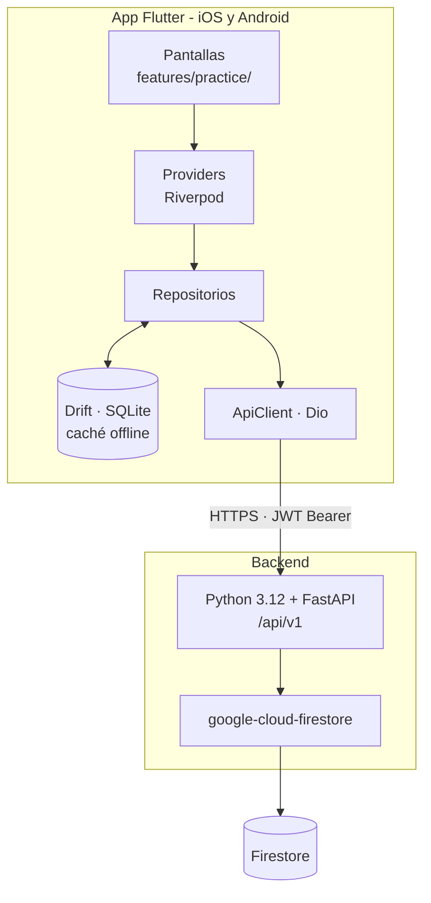

# Módulo de Preguntas — App Aprueba

> Núcleo de práctica de la aplicación móvil de **Aprueba**, plataforma de preparación para exámenes de admisión universitaria (PAES).

Proyecto de Título (Capstone) · Grupo 9 · Duoc UC San Bernardo · 2026


---

## Tabla de contenidos

- [Descripción](#descripción)
- [Estado del proyecto](#estado-del-proyecto)
- [Alcance](#alcance)
- [Tecnologías](#tecnologías)
- [Arquitectura](#arquitectura)
- [Instalación y ejecución](#instalación-y-ejecución)
- [Despliegue en Vercel](#despliegue-en-vercel)
- [Estructura del repositorio](#estructura-del-repositorio)
- [Metodología de trabajo](#metodología-de-trabajo)
- [Convenciones](#convenciones)
- [Equipo](#equipo)
- [Contexto académico](#contexto-académico)

---

## Descripción

Aprueba es una plataforma freemium de práctica intensiva para estudiantes que rinden exámenes estandarizados de admisión universitaria, con mercado inicial en Chile y expansión proyectada al Reino Unido. Su modelo entrega un flujo diario de preguntas desde un banco central, con desbloqueo progresivo a cambio de datos del estudiante y suscripciones de bajo costo.

Este repositorio contiene el **módulo de preguntas**: el ciclo funcional donde el estudiante recibe una pregunta, la responde contra reloj, conoce su resultado comparado con la cohorte, accede a la explicación paso a paso y a la habilidad evaluada, gestiona su cuota diaria y puede solicitar la recorrección de una pregunta que considere errónea.

Es el núcleo de valor del producto: sin él, la aplicación no cumple su propósito.

---

## Estado del proyecto

| | |
|---|---|
| Fase actual | Fase 2 — Desarrollo (semanas 5 a 15) |
| Iteración en curso | Iteración 2 · Modelo de datos y contratos (HU-20) |
| Próxima entrega funcional | Entrega 1, al cierre de la iteración 3 |

La Fase 1 cerró con la definición del proyecto documentada: enunciado de alcance, visión del producto, lista de historias de usuario, estructura de desglose del trabajo, carta Gantt, acta de constitución y documento de requerimientos.

---

## Alcance

### Incluido

**Seis pantallas** en el cliente móvil:

| Pantalla | Función |
|---|---|
| Pregunta | Enunciado y alternativas, cronómetro, descuento de cuota |
| Resultado | Acierto o error, alternativa correcta, explicación breve, percentil de velocidad, medalla obtenida |
| Explicación detallada | Planteamiento, pasos intermedios, verificación y concepto clave |
| Habilidad | Habilidad evaluada, nivel de dominio, árbol de prerrequisitos y recursos recomendados |
| Recorrección | Solicitud de revisión con motivo tipificado y comentario |
| Desbloqueo de cuota | Ampliación de la cuota diaria declarando colegio o región |

**Trece servicios** en el backend:

```
Práctica       GET  /practice/next
               GET  /questions/{id}
               POST /questions/{id}/answer
               GET  /questions/{id}/explanation
               GET  /questions/{id}/skill

Cuota          GET  /me/quota
               POST /me/quota/unlock

Recorrección   POST /corrections
               GET  /corrections

Configuración  GET  /tests
               GET  /me/preferences
               PUT  /me/preferences
               GET  /me/progress
```

Además: la lógica de cuota diaria escalonada y la economía de recompensas, el modelo de datos del módulo con su caché local sin conexión, la integración del manejo de sesión y renovación de credenciales, las pruebas unitarias y de integración, y el empaquetado en contenedores con despliegue reproducible.

### No incluido

Registro y autenticación, onboarding, pantalla de inicio, sistema de medallas y canjes, regalos y beneficios, grupos de estudio, comunidad, marketplace de tutores, muro de pago y suscripciones, ajustes y notificaciones.

Tampoco la consola de administración, el generador de preguntas, el sitio web del alumno ni la landing de marketing.

La pasarela de pago, el inicio de sesión social y las notificaciones push se consumen pero no se intervienen. La generación y curaduría del banco de preguntas es insumo de la empresa contraparte.

---

## Tecnologías

### Cliente móvil

| Componente | Tecnología | Rol |
|---|---|---|
| Framework | Flutter 3.22+ / Dart 3.3+ | Un solo código para iOS y Android |
| Estado | Riverpod | Gestión de estado reactiva y testeable |
| Navegación | GoRouter | Enrutamiento declarativo |
| Red | Dio | Cliente HTTP con interceptor de renovación de tokens |
| Persistencia local | Drift (SQLite) | Caché para repaso sin conexión |
| Almacenamiento seguro | flutter_secure_storage | Custodia del refresh token |

### Backend

| Componente | Tecnología | Rol |
|---|---|---|
| Lenguaje | Python 3.12 | Entorno de ejecución |
| Framework | FastAPI con Pydantic v2, sobre Uvicorn | API REST bajo `/api/v1` |
| Base de datos | Firestore (`google-cloud-firestore`, cliente asíncrono) | Persistencia, con emulador para desarrollo local |
| Autenticación | JWT HS256 (PyJWT) | Access token de 15 min + refresh de 30 días con rotación. La contraparte decidió pasar a Firebase Auth en una entrega posterior |
| Empaquetado | Docker | Imagen para Cloud Run en `backend/Dockerfile` |

### Justificación de las decisiones principales

- **Flutter** permite mantener un único código fuente para ambas plataformas móviles, algo determinante para un equipo de tres personas con plazo acotado.
- **Riverpod** ofrece inyección de dependencias y estado testeable sin acoplar la lógica al árbol de widgets, lo que facilita escribir la prueba antes que el código.
- **Drift** habilita el repaso sin conexión, requisito funcional del producto, con consultas tipadas y verificadas en tiempo de compilación.
- **Firestore** es la base de datos ya adoptada por el ecosistema; mantenerla evita divergencias en el modelo de datos.
- **FastAPI** es el framework que eligió la contraparte para el backend, el mismo del backend de administración de la consola. El módulo sigue sus convenciones de código y de respuesta (ADR-30 y ADR-31).

---

## Arquitectura



### Flujo de datos

La interfaz nunca conversa directamente con la red. Toda petición atraviesa la cadena `UI → provider → repositorio → ApiClient`. En cada lectura el repositorio escribe el resultado en la caché local y, ante un fallo de red, intenta servir la última copia disponible.

### Manejo de sesión

El access token viaja en la cabecera `Authorization`. Ante una respuesta 401, el interceptor de Dio renueva las credenciales con el refresh token, que rota en cada uso, y reintenta la petición original de forma transparente. Si la renovación falla, la sesión se marca como cerrada y el router redirige al inicio.

### Contrato de respuestas

Todas las respuestas de la API comparten una estructura común:

```json
{
  "data":  { },
  "error": null,
  "meta":  { "requestId": "...", "timestamp": "..." }
}
```

En caso de error, `data` es `null` y `error` contiene `code` (identificador estable, legible por máquina), `message` (texto listo para mostrar), `details` (una lista, vacía por defecto) y `field`.

Dos decisiones de diseño atraviesan todo el módulo:

- **Los códigos de error de negocio se traducen a estados de interfaz, no a mensajes genéricos.** Alcanzar la cuota base conduce a la pantalla de desbloqueo; no produce un error.
- **La respuesta correcta no viaja al cliente antes de que el estudiante responda.** Ni `GET /practice/next` ni `GET /questions/{id}` la incluyen. Es una regla de integridad del producto.

---

## Instalación y ejecución

### Requisitos previos

- Flutter 3.22 o superior (Dart 3.3+)
- Android Studio con el SDK de Android, o Xcode para iOS
- Python 3.12, con uv o pip
- Node.js, solo para correr `firebase-tools` con `npx`
- Java 21, que usa el emulador de Firestore
- Docker, solo para construir la imagen de Cloud Run

### Cliente móvil

```bash
# Instala las dependencias
flutter pub get

# Obligatorio: genera database.g.dart, requerido por Drift
dart run build_runner build --delete-conflicting-outputs

flutter run --dart-define=API_BASE_URL=http://127.0.0.1:4000/api/v1
```

> Sin ejecutar `build_runner` el proyecto no compila, porque la capa de persistencia local depende de código generado.

### Backend

```bash
# Emulador de Firestore, desde la raíz y en otra terminal
npx --yes firebase-tools emulators:start --only firestore --project demo-aprueba

cd backend
uv venv --python 3.12 .venv
uv pip install --python .venv -r requirements-dev.txt
cp .env.example .env
.venv/bin/python -m app.seed   # datos de prueba
.venv/bin/python -m app        # API en http://127.0.0.1:4000/api/v1
```

En Windows el intérprete es `.venv/Scripts/python.exe`. [`backend/README.md`](backend/README.md) trae la instalación con pip, las variables de entorno, las pruebas y la imagen de Docker.

### Configuración

No hay credenciales en el código. Todos los valores sensibles se inyectan mediante `--dart-define` en el cliente y variables de entorno en el backend.

### Verificación

```bash
flutter analyze                    # análisis estático
flutter test                       # pruebas unitarias
cd backend && .venv/bin/python -m pytest   # 24 pruebas del backend
```

Una de las pruebas del backend necesita el emulador de Firestore. Sin él, pytest informa 23 aprobadas y 1 omitida.

---

## Despliegue en Vercel

La versión web del módulo se compila y despliega automáticamente en Vercel mediante [`vercel.json`](vercel.json) y el script [`vercel-build.sh`](vercel-build.sh):

- **Pipeline de compilación (`buildCommand`):**
  1. Clona el SDK de Flutter (`stable`) en el contenedor si no existe.
  2. Agrega Flutter al `PATH`.
  3. Resuelve dependencias con `flutter pub get`.
  4. Genera el código Drift con `dart run build_runner build` (necesario para `database.g.dart`).
  5. Compila la app web en modo release inyectando la variable de entorno: `flutter build web --release --dart-define=API_BASE_URL=$API_BASE_URL`.
- **Directorio de salida (`outputDirectory`):** `build/web`.
- **Enrutamiento (`rewrites`):** Redirige todas las rutas hacia `/index.html` para permitir la navegación directa del cliente mediante GoRouter.

### Proyectos y URLs

| Proyecto de Vercel | Contenido | Root Directory | URL de producción |
|---|---|---|---|
| `aprueba-app-modulo-preguntas` | App Flutter Web | raíz del repositorio | https://aprueba-app-modulo-preguntas.vercel.app |
| `aprueba-app-modulo-preguntas-api` | API FastAPI | `backend/` | https://aprueba-app-modulo-preguntas-api.vercel.app/api/v1 |

Los dos proyectos están en el equipo `aprueba-app` de Vercel y conectados a este repositorio con `main` como rama de producción. La API corre en la región `gru1` (São Paulo). Firestore está en el proyecto Firebase `aprueba-app-modulo-preguntas`, plan Spark, con la base `(default)` en `southamerica-east1` (ADR-24 y ADR-25). `.firebaserc` fija ese proyecto como predeterminado.

### Variables de entorno

Solo nombres. Los valores se administran en cada proyecto de Vercel y no se versionan.

La app web usa `API_BASE_URL` en production y preview, con la URL de la API terminada en `/api/v1`. `vercel-build.sh` la lee al compilar, así que cambiar su valor obliga a volver a desplegar la app.

La API usa `APP_ENV`, `JWT_SECRET`, `FIREBASE_SERVICE_ACCOUNT_BASE64`, `FIREBASE_PROJECT_ID`, `ALLOWED_ORIGINS` y `ALLOWED_ORIGIN_PATTERN`, todas en production y preview. `APP_ENV` todavía no existe en el proyecto y hay que crearla antes de fusionar el backend FastAPI: `production` en production, y `production` o `staging` en preview. Vercel define `VERCEL=1`, y con esa variable la API no arranca si falta `APP_ENV` (ADR-36). `NODE_ENV` quedó del backend Node y ya no se lee. `JWT_SECRET` tiene un valor distinto en cada entorno. `ALLOWED_ORIGINS` lleva el origen de la app web sin barra final. Las URLs de vista previa de la app web cambian en cada despliegue, así que pasan CORS por `ALLOWED_ORIGIN_PATTERN`, que vale `^https://aprueba-app-modulo-preguntas-[a-z0-9-]+-aprueba-app\.vercel\.app$`. En Vercel no se definen `FIRESTORE_EMULATOR_HOST`, que desviaría la API al emulador, ni `SEED_ALLOW_REMOTE`. El resto de `backend/.env.example` (`PORT`, `QUOTA_RESET_HOUR_LOCAL`, `QUOTA_RESET_TIMEZONE`, `JWT_EXPIRES_IN` y `REFRESH_TOKEN_EXPIRES_IN`) queda con los valores por defecto de `backend/app/core/config.py`, que son los mismos del ejemplo.

Para rotar la cuenta de servicio se descarga un JSON nuevo desde la consola de Firebase y se guarda fuera del repositorio. En PowerShell, `[Convert]::ToBase64String([IO.File]::ReadAllBytes('RUTA_AL_JSON'))` lo convierte a base64, y ese resultado reemplaza `FIREBASE_SERVICE_ACCOUNT_BASE64` en los dos entornos.

### Cómo se despliega

Al fusionar en `main`, Vercel despliega la API y la app web a producción. `backend/vercel.json` declara el preset FastAPI con `app/main.py` como función y la región `gru1`, y desactiva los despliegues de Git de la API para cualquier otra rama (ADR-26 y ADR-30). Vercel instala `backend/requirements.txt` y toma Python 3.12 de `backend/.python-version`. La app web sí crea vistas previas por rama.

`backend/Dockerfile` construye la misma API para Cloud Run, el destino que usa el backend de administración. Ese servicio todavía no existe.

Las reglas y los índices de Firestore se publican aparte, desde la raíz del repositorio:

```bash
npx firebase-tools deploy --only firestore --project aprueba-app-modulo-preguntas
```

Un despliegue manual de la API se hace desde la raíz del repositorio y no desde `backend/`: con Root Directory `backend/` la CLI busca `backend/backend` y falla. Desde la raíz, la CLI sube el repositorio completo y no respeta `.gitignore`; solo excluye lo que lista `.vercelignore`. Por eso es más seguro hacerlo desde un checkout limpio, por ejemplo un `git worktree`. El 2026-09-23, `npx vercel deploy` sin `--prod` desde un checkout en `main` creó un despliegue de producción. Para una vista previa conviene pasar siempre `--target preview`.

### Verificación

```bash
curl -s https://aprueba-app-modulo-preguntas-api.vercel.app/api/v1/health
```

Responde 200 con `data.status` igual a `ok` y `error` en `null`. `meta.requestId` empieza con `req_`. Una ruta inexistente, como `/api/v1/ruta-inexistente`, responde 404 con `error.code` igual a `NOT_FOUND` en el mismo envelope. CORS se prueba con una solicitud previa:

```bash
curl -s -i -X OPTIONS https://aprueba-app-modulo-preguntas-api.vercel.app/api/v1/health \
  -H "Origin: https://aprueba-app-modulo-preguntas.vercel.app" \
  -H "Access-Control-Request-Method: GET"
```

La respuesta es 200, con cuerpo `OK` y `Access-Control-Allow-Origin` igual al origen de la app. El backend Node respondía 204; el 200 viene del `CORSMiddleware` de Starlette (ADR-39). Las vistas previas de la app web se prueban con el mismo comando y un origen como `https://aprueba-app-modulo-preguntas-git-main-aprueba-app.vercel.app`, que entra por `ALLOWED_ORIGIN_PATTERN`. Con un origen que no está en `ALLOWED_ORIGINS` ni calza con el patrón, la respuesta es 400 con el texto `Disallowed CORS origin` y sin esa cabecera.

Las vistas previas y las URLs propias de cada despliegue piden iniciar sesión en Vercel. Se prueban con `npx vercel curl URL -- -s -i`. En su primer uso, ese comando crea en el proyecto un secreto de "Protection Bypass for Automation".

### Datos de prueba

`SEED_ALLOW_REMOTE` no se define en Vercel. Para cargar el seed en el proyecto real se ejecuta `.venv/bin/python -m app.seed` desde `backend/`, con `SEED_ALLOW_REMOTE=true` y `FIREBASE_SERVICE_ACCOUNT_BASE64` definidas solo para esa ejecución, y la cuenta de servicio leída desde un JSON fuera del repositorio. Se corre desde `backend/` porque pydantic-settings carga el `.env` del directorio actual. El script reescribe documentos con IDs fijos y actualiza sus marcas de tiempo.

---

## Estructura del repositorio

```
.
├── lib/                         Cliente móvil Flutter
│   ├── app/                     configuración MaterialApp
│   ├── core/                    tema, i18n, router, red, storage, configuración
│   ├── data/
│   │   ├── local/               persistencia Drift
│   │   ├── models/              modelo lógico de la API
│   │   └── repositories/        un repositorio por dominio
│   ├── features/
│   │   └── practice/            ← módulo de preguntas
│   └── providers/               wiring de Riverpod
├── test/                        pruebas unitarias
│
├── backend/                     API REST (Python 3.12 + FastAPI)
│   ├── app/
│   │   ├── core/                configuración, envelope, errores, idioma, auth y paginación
│   │   ├── db/                  cliente de Firestore
│   │   ├── routers/             definición de endpoints
│   │   ├── schemas/             modelos Pydantic
│   │   ├── services/            lógica de negocio
│   │   └── seed/                datos de prueba en JSON
│   ├── tests/                   pruebas con pytest
│   ├── requirements.txt
│   └── Dockerfile               imagen para Cloud Run
│
├── docs/                        documentación del proyecto
│   ├── diccionario_de_datos.md  diccionario formal de colecciones
│   └── bitacora_decisiones.md   registro de decisiones arquitectónicas (ADR)
│
├── firestore.rules              reglas de seguridad de Firestore
├── firestore.indexes.json       índices compuestos de Firestore
└── seed/README.md               documentación de esquemas semilla
```

---

## Metodología de trabajo

El proyecto aplica **Extreme Programming** como metodología única.

La elección responde a un diagnóstico y no a una preferencia. El problema del equipo no era de organización sino técnico: ninguno de los tres había escrito Dart antes de comenzar. Extreme Programming prescribe las prácticas de ingeniería que ese problema exige, mientras que un marco de gestión por sí solo las deja a criterio del equipo. La coordinación de tres personas de la misma sección, con horario común, cabe en un tablero.

### Iteraciones

Diez iteraciones semanales, agrupadas en tres entregas funcionales.

| Entrega | Iteraciones | Semanas | Contenido |
|---|---|---|---|
| 1 | 1 a 3 | 5 a 7 | Entorno operativo, modelo de datos y la primera pantalla funcionando de punta a punta |
| 2 | 4 a 6 | 8 a 10 | El ciclo completo de aprendizaje: responder, entender por qué y conocer la habilidad evaluada |
| 3 | 7 a 10 | 11 a 14 | Cuota diaria, recorrección, funcionamiento sin conexión, pruebas de integración y contenedores |

Al inicio de cada iteración se eligen las historias, se estiman y se dividen en tareas. Al cierre se mide el trabajo completado, y ese dato sirve para planificar la iteración siguiente.

### Prácticas adoptadas

| Práctica | Aplicación |
|---|---|
| Programación en pares | Las tres primeras iteraciones se trabajan íntegramente en pares; después se mantiene para la lógica de cuota, el interceptor de sesión y la caché |
| Prueba antes que el código | Las reglas de cuota, recompensas y recorrección son verificables, así que se fijan como pruebas antes de implementarse |
| Integración continua | Se incorpora a la rama principal a diario, no al final de la semana |
| Refactorización | Mejora permanente del diseño existente, sin etapa separada |
| Diseño simple | La solución más sencilla que funcione y pase las pruebas |
| Propiedad colectiva | Cualquiera puede modificar cualquier archivo |
| Estándares de código | Analizador estático del proyecto y convenciones de Dart y de Python |
| Entregas pequeñas | Tres entregas funcionales durante el semestre, no una sola al final |
| Ritmo sostenible | El proyecto convive con el resto de las asignaturas |
| Reunión de pie | Corta, para sincronizar y detectar bloqueos |
| Juego de planificación | Al inicio de cada iteración |
| Metáfora | El módulo se entiende como el ciclo de práctica del estudiante: recibe una pregunta, responde, aprende del resultado y, si detecta un error, lo reclama |

### Desviaciones declaradas

**Cliente en sitio.** Extreme Programming contempla la presencia permanente del cliente durante el desarrollo. La contraparte no participa del trabajo diario, de modo que la práctica no se cumple. La mitigación tiene tres partes: un integrante asume el rol de cliente para las decisiones diarias, interpretando el contrato de servicios y las reglas documentadas sin inventar; cada decisión tomada sin confirmación queda registrada con su fuente y su impacto potencial; y las entregas funcionales se validan con la contraparte, aunque de forma espaciada.

**Reunión de pie diaria.** Se adapta a una sincronización semanal breve, porque los tres integrantes no comparten jornada completa.

Ambas se declaran por transparencia metodológica. Declarar la desviación vale más que sostener que se aplica la metodología completa.

---

## Convenciones

### Criterios de terminado

Una historia está terminada cuando sus pruebas de aceptación pasan. En concreto:

- Las pruebas unitarias están escritas y en verde
- `flutter analyze` no arroja advertencias
- El código fue revisado por al menos otro integrante
- Se respeta el contrato de respuestas y el catálogo de errores
- Los errores de negocio se traducen a estados de interfaz comprensibles
- La respuesta correcta no se expone antes de que el estudiante responda
- No hay credenciales ni secretos versionados

### Control de versiones

- Rama principal: `main`
- Ramas de trabajo: `feature/<descripción-breve>`
- Integración a `main` a diario, con revisión previa de al menos un integrante

---

## Equipo

| Integrante | Rol en XP | Responsabilidad principal |
|---|---|---|
| Martin Alonso Espinoza Morales | Coach y Tracker | Guía las prácticas, mide la velocidad, coordina con la empresa y ejerce como cliente delegado |
| Jeremías Danilo Fernández Millacura | Programador | Servicios de backend y modelo de datos |
| Sebastián Roberto Acevedo Araya | Programador | Cliente móvil y capa de presentación |

Los tres escriben sus propias pruebas: con un equipo de este tamaño, Extreme Programming no separa el rol de tester. La propiedad colectiva del código implica que estos focos indican responsabilidad principal, no exclusividad.

**Profesora guía:** Eliana Mallen González  
**Empresa contraparte:** Alloxentric, vinculada mediante la Incubadora Duoc UC San Bernardo  

---

## Contexto académico

Este repositorio corresponde al Proyecto de Título de la asignatura **PTY4614 Capstone**, sección CAPSTONE_002D, de la carrera de Ingeniería en Informática de **Duoc UC, sede San Bernardo**, durante el segundo semestre de 2026.

El desarrollo se organiza en tres fases: definición del proyecto, desarrollo del producto y presentación ante la comisión evaluadora.
