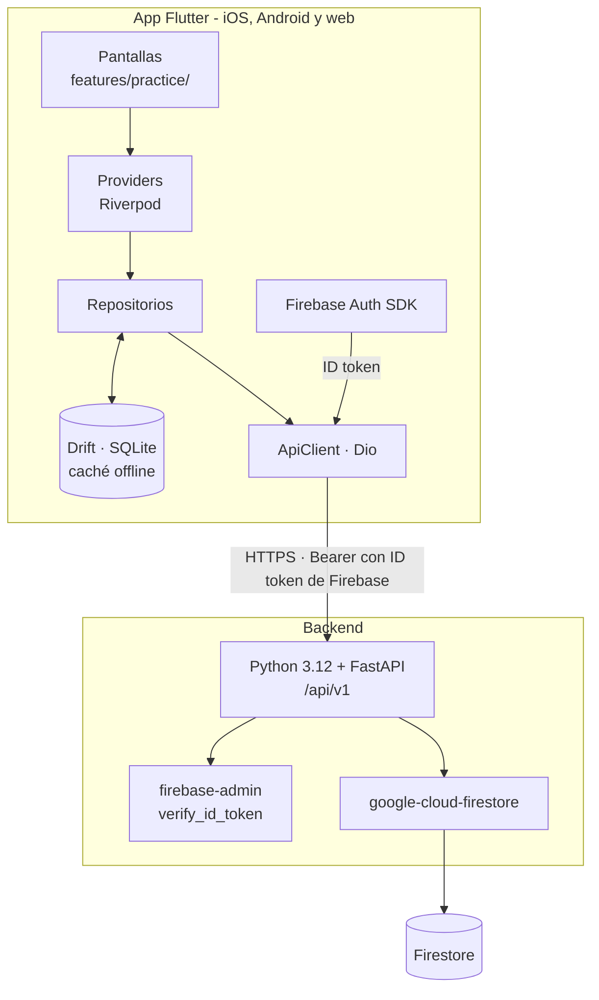

# Módulo de Preguntas de Aprueba

> Módulo de práctica de Aprueba para iOS, Android y web, plataforma de preparación para exámenes de admisión universitaria (PAES).

Proyecto de Título (Capstone) · Grupo 9 · Duoc UC San Bernardo · 2026


---

## Tabla de contenidos

- [Descripción](#descripción)
- [Estado del proyecto](#estado-del-proyecto)
- [Alcance](#alcance)
- [Tecnologías](#tecnologías)
- [Arquitectura](#arquitectura)
- [Instalación y ejecución](#instalación-y-ejecución)
- [Despliegue en Vercel](#despliegue-en-vercel)
- [Estructura del repositorio](#estructura-del-repositorio)
- [Metodología de trabajo](#metodología-de-trabajo)
- [Convenciones](#convenciones)
- [Equipo](#equipo)
- [Contexto académico](#contexto-académico)

---

## Descripción

Aprueba es una plataforma freemium de práctica intensiva para estudiantes que rinden exámenes estandarizados de admisión universitaria, con mercado inicial en Chile y expansión proyectada al Reino Unido. Su modelo entrega un flujo diario de preguntas desde un banco central, con desbloqueo progresivo a cambio de datos del estudiante y suscripciones de bajo costo.

Este repositorio contiene el módulo de preguntas: el ciclo funcional donde el estudiante recibe una pregunta, la responde contra reloj, conoce su resultado comparado con la cohorte, accede a la explicación paso a paso y a la habilidad evaluada, gestiona su cuota diaria y puede solicitar la recorrección de una pregunta que considere errónea.

Es el núcleo de valor del producto: sin él, la aplicación no cumple su propósito.

---

## Estado del proyecto

| | |
|---|---|
| Fase actual | Fase 2: Desarrollo (semanas 5 a 15) |
| Iteración en curso | Iteración 4 · semana 8, del 28/09 al 03/10/2026 |
| Última entrega aceptada | Entrega 1, aceptada por Martin el 29/09/2026 en T-24 |
| Próxima entrega funcional | Entrega 2, al cierre de la iteración 6, el 17/10/2026 |

Estado documental al 01/10/2026. Las fuentes vigentes están en Drive, carpeta `CAPSTONE_002D / Documentacion XP`: Product Backlog v2.3, Plan de entregas e iteraciones v1.3, EDT v3.2 con 55 paquetes, Gantt v2.1, Registro de interesados v1.4, Enunciado de Alcance v1.2 y Product Vision v1.4. Los RNF, criterios de terminado, plan de pruebas, reflexiones y aceptación T-24 completan el marco XP. Las diferencias entre el código y las decisiones vigentes se siguen como tareas del Product Backlog.

La iteración 4 tiene cinco historias y 15 puntos: HU-03, HU-04, HT-04, HU-12 y HT-06. El plan v1.3 propone adelantar HT-03 y llegar a 18 puntos; esa propuesta requiere acuerdo en el juego de planificación. Las velocidades registradas de las iteraciones 1 a 3 son 4, 5 y 26 puntos.

---

## Alcance

### Incluido

Seis pantallas en Flutter, con una sola base de código para iOS, Android y web (RNF-10):

| Pantalla | Función |
|---|---|
| Pregunta | Enunciado, cuatro o cinco alternativas y cronómetro; la cuota se descuenta al responder |
| Resultado | Acierto o error, alternativa correcta, explicación breve, percentil de velocidad, medalla obtenida |
| Explicación detallada | Planteamiento, pasos intermedios, verificación y concepto clave (`keyConcept`) |
| Habilidad | Habilidad evaluada, nivel de dominio, árbol de prerrequisitos y recursos recomendados |
| Recorrección | Solicitud de revisión con motivo tipificado y comentario |
| Desbloqueo de cuota | Ampliación de la cuota diaria declarando colegio o región |

Catorce servicios comprometidos en el backend: los trece del contrato y `GET /me`, incorporado por HT-07 para el perfil del alumno.

```
Práctica       GET  /practice/next
               GET  /questions/{id}
               POST /questions/{id}/answer
               GET  /questions/{id}/explanation
               GET  /questions/{id}/skill

Cuota          GET  /me/quota
               POST /me/quota/unlock

Recorrección   POST /corrections
               GET  /corrections

Configuración  GET  /tests
               GET  /me/preferences
               PUT  /me/preferences
               GET  /me/progress

Perfil         GET  /me
```

Además: la lógica de cuota diaria escalonada y la economía de recompensas, el modelo de datos del módulo con su caché local sin conexión, la integración del manejo de sesión y renovación de credenciales, las pruebas unitarias y de integración, y el empaquetado en contenedores con despliegue reproducible.

También se incluye el login con correo y contraseña mediante Firebase Auth, sin SMS (HU-21). El código expone cinco de esos servicios: `GET /me`, `GET /tests`, `GET` y `PUT /me/preferences` y `GET /practice/next`. La sonda `/health` no forma parte del conteo. `GET /questions/{id}` sigue ausente del checkout aunque T-20 figura hecha en el backlog; esa diferencia se registra en el informe.

### No incluido

Registro, recuperación de contraseña, onboarding, pantalla de inicio, pantallas de medallas y canjes, regalos y beneficios, grupos de estudio, comunidad, marketplace de tutores, muro de pago, suscripciones, ajustes y notificaciones. HU-22 fue retirada. La racha y la medalla diaria por login están fuera; el módulo solo actualiza `lastActivityAt` (ADR-82). Las medallas por respuesta y los datos de solicitudes de recorrección sí pertenecen al módulo (ADR-83).

Tampoco la consola de administración, el generador de preguntas, el sitio web del alumno ni la landing de marketing.

La pasarela de pago, el inicio de sesión social y las notificaciones push no se intervienen. La generación y curaduría del banco de preguntas es insumo de la empresa contraparte. La propuesta de curarlo con IA sigue pendiente y requeriría cambiar el alcance y planificar una historia. El banco real nunca se versiona en este repositorio. Su importación sigue pendiente de metadatos y curaduría de la empresa (ADR-75).

---

## Tecnologías

### Cliente Flutter

| Componente | Tecnología | Rol |
|---|---|---|
| Framework | Flutter 3.22+ / Dart 3.3+ | Un solo código para iOS, Android y web |
| Estado | Riverpod | Gestión de estado reactiva y testeable |
| Navegación | GoRouter | Enrutamiento declarativo |
| Red | Dio | Cliente HTTP. Su interceptor adjunta el ID token de Firebase y lo renueva una vez ante un 401 |
| Autenticación | Firebase Auth (`firebase_auth`) | Inicio de sesión con correo y contraseña. Entrega el ID token que valida la API |
| Persistencia local | Drift (SQLite) | Caché local; la práctica sin conexión sigue pendiente de HU-14 |
| Almacenamiento seguro | flutter_secure_storage | Lo usan el registro y el login social heredados, que no pasaron a Firebase. La sesión la guarda Firebase Auth |

### Backend

| Componente | Tecnología | Rol |
|---|---|---|
| Lenguaje | Python 3.12 | Entorno de ejecución |
| Framework | FastAPI con Pydantic v2, sobre Uvicorn | API REST bajo `/api/v1` |
| Base de datos | Firestore (`google-cloud-firestore`, cliente asíncrono) | Persistencia, con emulador para desarrollo local |
| Autenticación | Firebase Auth, con `firebase-admin` 7.7.0 | `verify_id_token` valida el ID token que envía la app. El backend no emite ni renueva tokens (ADR-40) |
| Empaquetado | Docker | Imagen para Cloud Run en `backend/Dockerfile` |

### Justificación de las decisiones principales

- Flutter permite mantener un único código fuente para iOS, Android y web (RNF-10).
- Riverpod ofrece inyección de dependencias y estado testeable sin acoplar la lógica al árbol de widgets, lo que facilita escribir la prueba antes que el código.
- Drift almacena la caché con consultas tipadas; HU-14 debe completar su recuperación para practicar sin conexión.
- Firestore es la base de datos ya adoptada por el ecosistema; mantenerla evita divergencias en el modelo de datos.
- FastAPI es el framework que eligió la contraparte para el backend, el mismo del backend de administración de la consola. El módulo sigue sus convenciones de código y de respuesta (ADR-30 y ADR-31).

---

## Arquitectura


```mermaid
flowchart TD
    subgraph client["App Flutter - iOS, Android y web"]
        UI["Pantallas<br/>features/practice/"]
        PROV["Providers<br/>Riverpod"]
        REPO["Repositorios"]
        CACHE[("Drift · SQLite<br/>caché offline")]
        API["ApiClient · Dio"]
        FBA["Firebase Auth SDK"]
    end

    subgraph server["Backend"]
        FASTAPI["Python 3.12 + FastAPI<br/>/api/v1"]
        ADMIN["firebase-admin<br/>verify_id_token"]
        SDK["google-cloud-firestore"]
    end

    DB[("Firestore")]

    UI --> PROV
    PROV --> REPO
    REPO --> API
    REPO <--> CACHE
    FBA -->|"ID token"| API
    API -->|"HTTPS · Bearer con ID token de Firebase"| FASTAPI
    FASTAPI --> ADMIN
    FASTAPI --> SDK
    SDK --> DB
```

### Flujo de datos

La interfaz nunca conversa directamente con la red. Toda petición atraviesa la cadena `UI → provider → repositorio → ApiClient`. Los repositorios guardan datos en Drift; el perfil tiene recuperación de caché ante un fallo de red. `PracticeRepository.next()` todavía exige red: el repaso sin conexión completo corresponde a HU-14, iteración 9, y no se da por terminado.

### Manejo de sesión

El estudiante inicia sesión con correo y contraseña en Firebase Auth. Firebase guarda la sesión en el dispositivo y entrega un ID token que dura una hora y que su SDK renueva solo. `ApiClient` lo envía en la cabecera `Authorization` junto con `Accept-Language`, que lleva el idioma elegido en la app. El backend lo valida con `verify_id_token` de `firebase-admin` y no emite tokens propios.

Ante una respuesta 401, el interceptor de Dio pide a Firebase un token nuevo con `getIdToken(forceRefresh: true)` y reintenta la petición una sola vez. Si el reintento también da 401, o Firebase ya no tiene usuario, cierra la sesión con el mismo logout del botón de ajustes, que borra la caché de Drift, y el router redirige al inicio. Un token vencido da `AUTH_TOKEN_EXPIRED` y uno ausente o inválido da `AUTH_REQUIRED`, los dos con status 401. Las decisiones están en ADR-40 y en las propuestas ADR-43 a ADR-55 de la [bitácora](docs/bitacora_decisiones.md).

El cliente heredado conserva registro, login social y recuperación con rutas `/auth/*` ausentes del backend. Están fuera del alcance vigente y no son un flujo operativo del módulo. La entrada es el login por Firebase Auth con cuentas creadas en su consola (HU-21, ADR-41). `PHONE_VERIFICATION_ENABLED` está apagada por defecto; HU-21 no incluye SMS.

### Contrato de respuestas

Todas las respuestas de la API comparten una estructura común:

```json
{
  "data":  { },
  "error": null,
  "meta":  { "requestId": "...", "timestamp": "..." }
}
```

En caso de error, `data` es `null` y `error` contiene `code` (identificador estable, legible por máquina), `message` (texto listo para mostrar), `details` (una lista, vacía por defecto) y `field`.

Dos decisiones de diseño atraviesan todo el módulo:

- **Los códigos de error de negocio se traducen a estados de interfaz, no a mensajes genéricos.** Alcanzar la cuota base conduce a la pantalla de desbloqueo; no produce un error.
- La respuesta correcta y la explicación no viajan al cliente antes de responder (RNF-02). `GET /practice/next` ya elimina ambos campos. El mismo control debe aplicarse al futuro `GET /questions/{id}` y a cualquier otra ruta; la prueba general aún solo detecta `correctAnswer`.

### Reglas confirmadas por Max

La cuota gratuita empieza en 10, suma 5 por colegio y 5 por región, con tope 20. `plans.free.limits.qDay=20` representa el tope; `qDay=0` significa ilimitado. El código y el seed aún usan `qDay` como base y `free.qDay=10`; su corrección queda para planificación (ADR-76).

La cuota se descuenta al responder. Hasta entonces debe mantenerse la misma pregunta pendiente, también entre solicitudes concurrentes (ADR-81, RNF-04). La selección respeta la dificultad sin ampliarla y avisa al agotarse (ADR-78). El facsímil requiere `mock_mode` en el plan y un orden fijo por prueba, ambos pendientes de completar en HU-12 (ADR-77 y ADR-79). Los modelos ya admiten cuatro o cinco alternativas; falta cobertura de cinco de punta a punta (ADR-80).

El tiempo para el percentil debe medirse desde la entrega registrada por el servidor. El cliente aún envía el tiempo de su cronómetro; T-28 y T-30 cubren la medición y el histograma, sin consultas agregadas de Firestore (RNF-12).

---

## Instalación y ejecución

### Requisitos previos

- Flutter 3.22 o superior (Dart 3.3+)
- Android Studio con el SDK de Android, o Xcode para iOS
- Python 3.12, con uv o pip
- Node.js, solo para correr `firebase-tools` con `npx`
- Java 21, que usa el emulador de Firestore
- Docker, solo para construir la imagen de Cloud Run

### Cliente Flutter

```bash
# Instala las dependencias
flutter pub get

# Obligatorio: genera database.g.dart, requerido por Drift
dart run build_runner build --delete-conflicting-outputs

flutter run --dart-define=API_BASE_URL=http://127.0.0.1:4000/api/v1

# Web, contra la API desplegada
flutter build web --release \
  --dart-define=API_BASE_URL=https://aprueba-app-modulo-preguntas-api.vercel.app/api/v1
```

> Sin ejecutar `build_runner` el proyecto no compila, porque la capa de persistencia local depende de código generado.

`API_BASE_URL` se pasa siempre. Su valor por defecto en `lib/core/config/app_config.dart` es `https://api.staging.aprueba.cl/api/v1`, heredado del cliente, y esa API no es la del módulo. No se activa `PHONE_VERIFICATION_ENABLED` para HU-21.

La configuración de cliente de Firebase ya está en el repositorio: `lib/firebase_options.dart`, `android/app/google-services.json` e `ios/Runner/GoogleService-Info.plist`, del proyecto `aprueba-app-modulo-preguntas`. No hace falta correr `flutterfire configure`. Si se corre, reemplaza `firebase_options.dart` con el mismo formato (ADR-42).

La app arranca aunque Firebase no cargue, por ejemplo en web con `gstatic.com` bloqueado, pero lo hace sin sesión y el login tampoco funciona hasta que Firebase cargue (ADR-54).

### Backend

```bash
# Emulador de Firestore, desde la raíz y en otra terminal
npx --yes firebase-tools emulators:start --only firestore --project demo-aprueba

cd backend
uv venv --python 3.12 .venv
uv pip install --python .venv -r requirements-dev.txt
cp .env.example .env
.venv/bin/python -m app.seed   # datos de prueba
.venv/bin/python -m app        # API en http://127.0.0.1:4000/api/v1
```

El seed necesita en `.env` los UID de las dos cuentas de demostración, `SEED_DEMO_UID` y `SEED_DEMO_NEW_UID` (ADR-58). En Windows el intérprete es `.venv/Scripts/python.exe`. [`backend/README.md`](backend/README.md) trae la instalación con pip, las variables de entorno, las pruebas y la imagen de Docker.

### Configuración

No hay credenciales en el código. Los valores sensibles se inyectan mediante `--dart-define` en el cliente y variables de entorno en el backend. La `apiKey` de los archivos de cliente de Firebase no es una credencial: identifica el proyecto y viaja dentro de cualquier build de la app. Los datos los protegen `firestore.rules`, que niega todo acceso al cliente, y la verificación del ID token en la API. La cuenta de servicio del backend sí es secreta y nunca se versiona (ADR-42).

### Verificación

```bash
flutter analyze                    # análisis estático
flutter test                       # pruebas unitarias
cd backend && .venv/bin/python -m pytest   # con el emulador activo
```

El 01/10/2026, con el código de `main` en `df925e0`, `flutter analyze` informó 24 avisos informativos, sin advertencias ni errores y ninguno en `lib/features/practice/`; 18 son `withOpacity` (ADR-08). `flutter test` dio 56 aprobadas. pytest sin el emulador dio 40 aprobadas y 22 omitidas, las que necesitan Firestore; el Plan de pruebas v1.0 registra las 62 aprobadas con el emulador al cierre de la iteración 3. Un cambio de código se valida con todas, emulador incluido.

---

## Despliegue en Vercel

La versión web del módulo se compila y despliega automáticamente en Vercel mediante [`vercel.json`](vercel.json) y el script [`vercel-build.sh`](vercel-build.sh):

- **Pipeline de compilación (`buildCommand`):**
  1. Clona el SDK de Flutter (`stable`) en el contenedor si no existe.
  2. Agrega Flutter al `PATH`.
  3. Resuelve dependencias con `flutter pub get`.
  4. Genera el código Drift con `dart run build_runner build` (necesario para `database.g.dart`).
  5. Compila la app web en modo release inyectando la variable de entorno: `flutter build web --release --dart-define=API_BASE_URL=$API_BASE_URL`.
- **Directorio de salida (`outputDirectory`):** `build/web`.
- **Enrutamiento (`rewrites`):** Redirige todas las rutas hacia `/index.html` para permitir la navegación directa del cliente mediante GoRouter.

### Proyectos y URLs

| Proyecto de Vercel | Contenido | Root Directory | URL de producción |
|---|---|---|---|
| `aprueba-app-modulo-preguntas` | App Flutter Web | raíz del repositorio | https://aprueba-app-modulo-preguntas.vercel.app |
| `aprueba-app-modulo-preguntas-api` | API FastAPI | `backend/` | https://aprueba-app-modulo-preguntas-api.vercel.app/api/v1 |

Los dos proyectos están en el equipo `aprueba-app` de Vercel y conectados a este repositorio con `main` como rama de producción. La API corre en la región `gru1` (São Paulo). Firestore está en el proyecto Firebase `aprueba-app-modulo-preguntas`, plan Spark, con la base `(default)` en `southamerica-east1` (ADR-24 y ADR-25). `.firebaserc` fija ese proyecto como predeterminado.

### Variables de entorno

Solo nombres. Los valores se administran en cada proyecto de Vercel y no se versionan.

La app web usa `API_BASE_URL` en production y preview, con la URL de la API terminada en `/api/v1`. `vercel-build.sh` la lee al compilar, así que cambiar su valor obliga a volver a desplegar la app.

La API usa `APP_ENV`, `FIREBASE_SERVICE_ACCOUNT_BASE64`, `FIREBASE_PROJECT_ID`, `ALLOWED_ORIGINS` y `ALLOWED_ORIGIN_PATTERN`, todas en production y preview. `APP_ENV` vale `production` en production y en preview desde el 2026-09-24. La API en Node no la lee. Vercel define `VERCEL=1`, y con esa variable la API no arranca si falta `APP_ENV` (ADR-36). `FIREBASE_PROJECT_ID` solo sirve para validar tokens: es la audiencia que exige `verify_id_token`, así que tiene que ser `aprueba-app-modulo-preguntas`, el proyecto donde la app inicia sesión, o quedar sin valor para que se use el `project_id` de la cuenta de servicio. Firestore usa siempre el proyecto de la cuenta de servicio (ADR-49). `ALLOWED_ORIGINS` lleva el origen de la app web sin barra final. Las URLs de vista previa de la app web cambian en cada despliegue, así que pasan CORS por `ALLOWED_ORIGIN_PATTERN`, que vale `^https://aprueba-app-modulo-preguntas-[a-z0-9-]+-aprueba-app\.vercel\.app$`. En Vercel no se definen `FIRESTORE_EMULATOR_HOST`, que desviaría la API al emulador, ni `SEED_ALLOW_REMOTE`. Tampoco `FIREBASE_AUTH_EMULATOR_HOST`: con ella la API no arranca fuera de local (ADR-50). El resto de `backend/.env.example` (`PORT`, `QUOTA_RESET_HOUR_LOCAL` y `QUOTA_RESET_TIMEZONE`) queda con los valores por defecto de `backend/app/core/config.py`, que son los mismos del ejemplo.

`JWT_SECRET`, `JWT_EXPIRES_IN`, `REFRESH_TOKEN_EXPIRES_IN` y `NODE_ENV` eran del backend Node y no se leen desde la migración a Firebase Auth (ADR-40). Ya no están en el proyecto de Vercel de la API (revisado el 2026-09-27).

Para rotar la cuenta de servicio se descarga un JSON nuevo desde la consola de Firebase y se guarda fuera del repositorio. En PowerShell, `[Convert]::ToBase64String([IO.File]::ReadAllBytes('RUTA_AL_JSON'))` lo convierte a base64, y ese resultado reemplaza `FIREBASE_SERVICE_ACCOUNT_BASE64` en los dos entornos.

### Cómo se despliega

Al fusionar en `main`, Vercel despliega la API y la app web a producción. `backend/vercel.json` declara el preset FastAPI con `app/main.py` como función y la región `gru1`, y desactiva los despliegues de Git de la API para cualquier otra rama (ADR-26 y ADR-30). Vercel instala `backend/requirements.txt` y toma Python 3.12 de `backend/.python-version`. La app web sí crea vistas previas por rama.

`backend/Dockerfile` construye la misma API para Cloud Run, el destino que usa el backend de administración. Ese servicio todavía no existe. Los contenedores para levantar el backend con el emulador de Firestore son HT-03, con T-33 y T-34.

Las reglas y los índices de Firestore se publican aparte, desde la raíz del repositorio:

```bash
npx firebase-tools deploy --only firestore --project aprueba-app-modulo-preguntas
```

Un despliegue manual de la API se hace desde la raíz del repositorio y no desde `backend/`: con Root Directory `backend/` la CLI busca `backend/backend` y falla. Desde la raíz, la CLI sube el repositorio completo y no respeta `.gitignore`; solo excluye lo que lista `.vercelignore`. Por eso es más seguro hacerlo desde un checkout limpio, por ejemplo un `git worktree`. El 2026-09-23, `npx vercel deploy` sin `--prod` desde un checkout en `main` creó un despliegue de producción. Para una vista previa conviene pasar siempre `--target preview`.

### Verificación

```bash
curl -s https://aprueba-app-modulo-preguntas-api.vercel.app/api/v1/health
```

Responde 200 con `data.status` igual a `ok` y `error` en `null`. `meta.requestId` empieza con `req_`. Una ruta inexistente, como `/api/v1/ruta-inexistente`, responde 404 con `error.code` igual a `NOT_FOUND` en el mismo envelope. CORS se prueba con una solicitud previa:

```bash
curl -s -i -X OPTIONS https://aprueba-app-modulo-preguntas-api.vercel.app/api/v1/health \
  -H "Origin: https://aprueba-app-modulo-preguntas.vercel.app" \
  -H "Access-Control-Request-Method: GET"
```

La respuesta es 200, con cuerpo `OK` y `Access-Control-Allow-Origin` igual al origen de la app. El backend Node respondía 204; el 200 viene del `CORSMiddleware` de Starlette (ADR-39). Las vistas previas de la app web se prueban con el mismo comando y un origen como `https://aprueba-app-modulo-preguntas-git-main-aprueba-app.vercel.app`, que entra por `ALLOWED_ORIGIN_PATTERN`. Con un origen que no está en `ALLOWED_ORIGINS` ni calza con el patrón, la respuesta es 400 con el texto `Disallowed CORS origin` y sin esa cabecera.

Las vistas previas y las URLs propias de cada despliegue piden iniciar sesión en Vercel. Se prueban con `npx vercel curl URL -- -s -i`. En su primer uso, ese comando crea en el proyecto un secreto de "Protection Bypass for Automation".

### Datos de prueba

`SEED_ALLOW_REMOTE` no se define en Vercel. Una carga al proyecto real requiere `main` revisada, autorización para la carga y aceptación posterior de Martin. Se ejecuta `.venv/bin/python -m app.seed` desde `backend/`, con `SEED_ALLOW_REMOTE=true`, `SEED_DEMO_UID`, `SEED_DEMO_NEW_UID` y `FIREBASE_SERVICE_ACCOUNT_BASE64` definidas solo para esa ejecución, y la cuenta de servicio leída desde un JSON fuera del repositorio. Se corre desde `backend/` porque pydantic-settings carga el `.env` del directorio actual. El script reescribe documentos con IDs fijos y actualiza sus marcas de tiempo. El seed todavía carga `qDay` 10 en el plan `free`, una diferencia con ADR-76.

---

## Estructura del repositorio

```
.
├── lib/                         Cliente Flutter para iOS, Android y web
│   ├── app/                     configuración MaterialApp
│   ├── core/                    tema, i18n, router, red, storage, configuración
│   ├── data/
│   │   ├── local/               persistencia Drift
│   │   ├── models/              modelo lógico de la API
│   │   └── repositories/        un repositorio por dominio
│   ├── features/
│   │   └── practice/            ← módulo de preguntas
│   ├── providers/               wiring de Riverpod
│   └── firebase_options.dart    configuración de cliente de Firebase (ADR-42)
├── test/                        pruebas unitarias
│
├── backend/                     API REST (Python 3.12 + FastAPI)
│   ├── app/
│   │   ├── core/                configuración, envelope, errores, idioma, token de Firebase y paginación
│   │   ├── db/                  cliente de Firestore y Firebase Admin
│   │   ├── routers/             definición de endpoints
│   │   ├── schemas/             modelos Pydantic
│   │   ├── services/            lógica de negocio
│   │   └── seed/                datos de prueba en JSON
│   ├── tests/                   pruebas con pytest
│   ├── requirements.txt
│   └── Dockerfile               imagen para Cloud Run
│
├── docs/                        documentación del proyecto
│   ├── diccionario_de_datos.md  diccionario formal de colecciones
│   └── bitacora_decisiones.md   registro de decisiones arquitectónicas (ADR)
│
├── firestore.rules              reglas de seguridad de Firestore
├── firestore.indexes.json       índices compuestos de Firestore
└── seed/README.md               documentación de esquemas semilla
```

---

## Metodología de trabajo

El proyecto aplica **Extreme Programming** como metodología única.

La elección responde a un diagnóstico y no a una preferencia. El problema del equipo no era de organización sino técnico: ninguno de los tres había escrito Dart antes de comenzar. Extreme Programming prescribe las prácticas de ingeniería que ese problema exige, mientras que un marco de gestión por sí solo las deja a criterio del equipo. La coordinación de tres personas de la misma sección, con horario común, cabe en un tablero.

### Iteraciones

Diez iteraciones semanales, agrupadas en tres entregas funcionales.

| Entrega | Iteraciones | Semanas | Contenido |
|---|---|---|---|
| 1 | 1 a 3 | 5 a 7 | Entorno operativo, modelo de datos y la primera pantalla funcionando de punta a punta |
| 2 | 4 a 6 | 8 a 10 | El ciclo completo de aprendizaje: responder, entender por qué y conocer la habilidad evaluada |
| 3 | 7 a 10 | 11 a 14 | Cuota diaria, recorrección, funcionamiento sin conexión, pruebas de integración y contenedores |

Al inicio de cada iteración se eligen las historias, se estiman y se dividen en tareas. Solo las historias que cumplen todos los criterios de terminado suman puntos; el avance parcial se replanifica sin contabilizarlo. Se conserva el nombre Product Backlog (lista de producto) adoptado por el equipo; las equivalencias académicas con Scrum no cambian la metodología XP. Los identificadores vigentes son E1 a E7, F, HU, HT, RT-01 a RT-04 y T.

La semana 1 empezó el 10/08/2026. El calendario siguiente usa semanas de lunes a sábado:

| Semana | Fechas | Hito |
|---|---|---|
| 8 | 28/09 al 03/10 | Alloxentric: MVP con base de datos operativa |
| 9 | 05/10 al 10/10 | Informe de avance |
| 10 | 12/10 al 17/10 | Presentación de avance y video de 5 minutos |
| 11 | 19/10 al 24/10 | Retroalimentación |
| 12 | 26/10 al 31/10 | Alloxentric: proyecto en contenedores |
| 13 | 02/11 al 07/11 | Presentación y definición de continuidad |
| 15 | 16/11 al 21/11 | Informe final; hito final de Alloxentric del 16/11 al 28/11 |
| 16 | 23/11 al 28/11 | Correcciones posteriores al informe final |
| 17 | 30/11 al 05/12 | Presentación a comisión |
| 18 | 07/12 al 12/12 | Presentación a empresas vinculadas |

### Prácticas adoptadas

| Práctica | Aplicación |
|---|---|
| Programación en pares | Las tres primeras iteraciones se trabajan íntegramente en pares; después se mantiene para la lógica de cuota, el interceptor de sesión y la caché |
| Prueba antes que el código | Las reglas de cuota, recompensas y recorrección son verificables, así que se fijan como pruebas antes de implementarse |
| Integración continua | Cada cambio entra a `main` por un PR revisado y aprobado por otro integrante (RT-03) |
| Refactorización | Mejora permanente del diseño existente, sin etapa separada |
| Diseño simple | La solución más sencilla que funcione y pase las pruebas |
| Propiedad colectiva | Cualquiera puede modificar cualquier archivo |
| Estándares de código | Analizador estático del proyecto y convenciones de Dart y de Python |
| Entregas pequeñas | Tres entregas funcionales durante el semestre, no una sola al final |
| Ritmo sostenible | El proyecto convive con el resto de las asignaturas |
| Reunión de pie | Corta, para sincronizar y detectar bloqueos |
| Juego de planificación | Al inicio de cada iteración |
| Metáfora | El módulo se entiende como el ciclo de práctica del estudiante: recibe una pregunta, responde, aprende del resultado y, si detecta un error, lo reclama |

### Desviaciones declaradas

**Cliente en sitio.** Max ejerce el rol de Cliente, pero no participa del trabajo diario. Las entregas se validan con Karina, y las definiciones que faltan se consultan a Max por escrito. Mientras no hay respuesta, el supuesto queda en la bitácora con su fuente y su impacto. Martin traduce la especificación documentada en pruebas de aceptación, sin sustituir a Max como Cliente.

**Reunión de pie diaria.** Se adapta a una sincronización semanal breve, porque los tres integrantes no comparten jornada completa.

Ambas se declaran por transparencia metodológica. Declarar la desviación vale más que sostener que se aplica la metodología completa.

---

## Convenciones

### Criterios de terminado

Los Criterios de terminado v1.0 establecen siete condiciones:

- Martin verifica los criterios de aceptación en el entorno desplegado y registra resultados.
- Las pruebas unitarias se escriben antes del código y pasan; la integridad impide exponer respuesta o explicación antes de responder (RNF-02).
- El analizador no informa advertencias en el módulo y se respetan las convenciones de Dart y Python.
- Un integrante distinto del autor revisa y aprueba el PR en GitHub; se integra a `main` sin conflictos.
- Las respuestas respetan datos, error y metadatos, y el catálogo; los errores de negocio se presentan como estados de interfaz.
- No se versionan credenciales, claves privadas ni datos reales de usuarios; los datos de producción proceden de `main` revisada.
- Las decisiones y los supuestos quedan registrados en las bitácoras correspondientes.

La prueba de aceptación T-24, del 29/09, aprobó ocho de ocho pasos sobre producción y registró los hallazgos H-01 a H-07. Los del módulo pasaron a tareas de la iteración 4: H-01 a T-27, H-02 a T-26 y H-03 a T-28. Se ejecutó con el banco sintético recargado después de fusionar del #25 al #28. Cada carga posterior sigue el mismo orden: datos desde `main` revisada y una nueva prueba de aceptación de Martin.

### Control de versiones

- Rama principal: `main`
- Ramas de trabajo: `feature/<descripción-breve>`
- Integración continua por PR con revisión y aprobación en GitHub de otro integrante; las fusiones usan "Create a merge commit"

---

## Equipo

| Integrante | Rol en XP | Responsabilidad principal |
|---|---|---|
| Max Kreimerman, Alloxentric | Cliente | Contraparte: confirma alcance, reglas de negocio y prioridades |
| Karina Álvarez, Alloxentric | Gestora | Jefa de proyecto: seguimiento semanal, validación de entregas y coordinación con Max |
| Eliana Mallen González | Coach | Guía las prácticas XP y el proceso académico |
| Martin Alonso Espinoza Morales | Tracker y Tester | Mide la velocidad y verifica aceptación independiente, sin programar la funcionalidad que valida |
| Jeremías Danilo Fernández Millacura | Programador backend | Servicios de backend y modelo de datos |
| Sebastián Roberto Acevedo Araya | Programador frontend | Cliente Flutter y capa de presentación |

Jeremías y Sebastián escriben pruebas unitarias con TDD y revisan el código entre pares. Martin ejecuta aceptación sobre el entorno desplegado y registra los resultados. La propiedad colectiva del código mantiene la responsabilidad compartida del equipo.

**Profesora guía:** Eliana Mallen González  
**Empresa contraparte:** Alloxentric, vinculada mediante la Incubadora Duoc UC San Bernardo  

---

## Contexto académico

Este repositorio corresponde al Proyecto de Título de la asignatura **PTY4614 Capstone**, sección CAPSTONE_002D, de la carrera de Ingeniería en Informática de **Duoc UC, sede San Bernardo**, durante el segundo semestre de 2026.

El desarrollo se organiza en tres fases: definición del proyecto, desarrollo del producto y presentación ante la comisión evaluadora.
