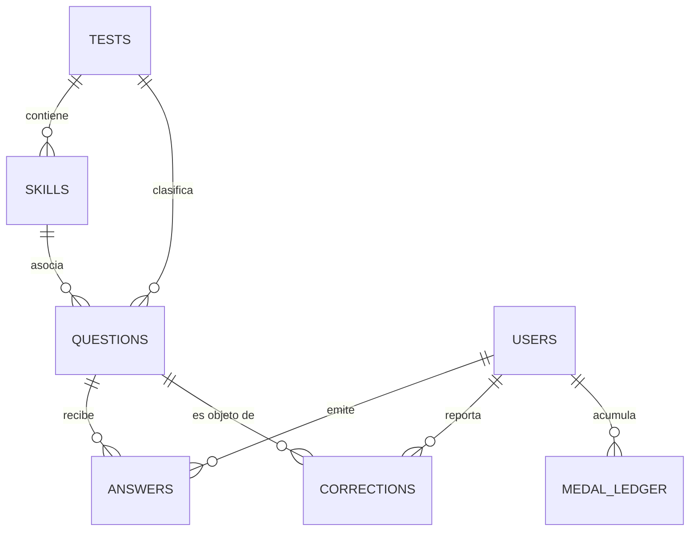

# Diccionario de Datos — Módulo de Preguntas Aprueba

**Proyecto:** Aprueba — Plataforma de práctica para la PAES  
**Equipo:** Grupo 9, Duoc UC · Proyecto Capstone (PTY4614)  
**Entregable:** Paquete de Trabajo 1.3.2.1 (EDT) · Iteración 2 (Semana 6)  
**Responsable:** Jeremías Fernández  
**Motor de Persistencia Principal:** Google Cloud Firestore (Modo Datastore / Serveless NoSQL)  
**Caché Local de Dispositivo:** SQLite v3 administrado mediante Drift (ORM Dart)  

---

## 1. Arquitectura de Datos Global

El sistema utiliza una arquitectura híbrida:
1. **Base Central (Backend - Firestore):** Fuente de verdad relacional documental. Aloja el catálogo curricular, el banco de preguntas auditado, el registro inmutable de respuestas de la cohorte y el libro mayor (*ledger*) de recompensas.
2. **Caché en Cliente Móvil (SQLite/Drift):** Almacenamiento local seguro offline-first. Almacena temporalmente la pregunta en curso, registros locales y preferencias para permitir resolución sin red garantizando la regla de integridad (omisión de clave de corrección hasta el envío de respuesta).

---

## 2. Especificación de Colecciones Firestore

### 2.1 Colección `tests`
* **Ámbito:** Colección raíz pública.
* **Propósito:** Catálogo oficial de las 5 pruebas de la batería PAES.
* **Política de Seguridad:** Lectura pública (`allow read: if true;`), escritura bloqueada para clientes (`allow write: if false;`).

| Campo | Tipo de Dato | Obligatorio | Restricciones / Formato | Descripción |
|---|---|:---:|---|---|
| `id` | `String` (Document ID) | Sí | `lectora` \| `m1` \| `m2` \| `cien` \| `hist` | Identificador canónico de la prueba. |
| `label` | `String` | Sí | Texto corto (máx. 30 chars) | Nombre legible para la interfaz gráfica. |
| `color` | `String` | Sí | Hexadecimal `#RRGGBB` | Color distintivo de la prueba para barras y etiquetas. |
| `hasQuestions`| `Boolean` | Sí | `true` para PAES | Indica disponibilidad operativa de banco de preguntas. |

---

### 2.2 Colección `skills`
* **Ámbito:** Colección raíz pública.
* **Propósito:** Árbol de competencias y habilidades curriculares por prueba.
* **Política de Seguridad:** Lectura pública, escritura exclusiva por script seed o panel administrativo.

| Campo | Tipo de Dato | Obligatorio | Restricciones / Formato | Descripción |
|---|---|:---:|---|---|
| `id` | `String` (Document ID) | Sí | Prefijo `sk_` + slug | Identificador único de la competencia. |
| `name` | `String` | Sí | Texto (máx. 100 chars) | Nombre pedagógico de la habilidad. |
| `testId` | `String` | Sí | FK -> `tests.id` | Prueba a la que pertenece la competencia. |
| `domain` | `String` | Sí | Texto descriptivo | Eje o dominio temático macro. |
| `level` | `Integer` | Sí | Rango `[1, 4]` | Nivel de complejidad curricular. |
| `maxLevel` | `Integer` | Sí | Valor por defecto: `4` | Nivel máximo de maestría. |
| `prerequisiteIds` | `Array<String>` | Sí | Lista de `skills.id` | Prerrequisitos de aprendizaje requeridos. |
| `status` | `String` | Sí | `done` \| `active` \| `locked` | Estado del nodo pedagógico. |
| `resources` | `Array<Map>` | No | Lista de objetos de recurso | Material didáctico asociado (ver sub-esquema). |

#### Sub-esquema: `SkillResource` (Map embebido)
* `type`: `String` (`video` | `pdf` | `exercise`)
* `title`: `String` (Título del recurso)
* `url`: `String` (URI externa segura HTTPS)
* `duration`: `String?` (Ejemplo: `"12 min"`)
* `source`: `String?` (Ejemplo: `"YouTube"`, `"Aprueba Editorial"`)

---

### 2.3 Colección `questions`
* **Ámbito:** Colección raíz autenticada.
* **Propósito:** Banco central de ítems de evaluación tipo PAES.
* **Política de Seguridad:** Lectura autenticada (`request.auth != null`), escritura restringida a administradores.
* **Regla de Integridad Fundamental:** El campo `correctAnswer` se almacena exclusivamente para evaluación en servidor. La API omite este campo en `GET /practice/next` y `GET /questions/:id`.

| Campo | Tipo de Dato | Obligatorio | Restricciones / Formato | Descripción |
|---|---|:---:|---|---|
| `id` | `String` (Document ID) | Sí | Prefijo `q_` + slug | Identificador único del ítem. |
| `testId` | `String` | Sí | FK -> `tests.id` | Código de la prueba a la que pertenece. |
| `axis` | `String?` | No | Texto | Eje temático específico del temario DEMRE. |
| `skillId` | `String?` | No | FK -> `skills.id` | Habilidad curricular que evalúa. |
| `difficulty` | `String` | Sí | `d1` \| `d2` \| `d3` \| `d4` | Dificultad psicométrica calibrada. |
| `statement` | `String` | Sí | Texto Markdown | Enunciado completo con soporte LaTeX/KaTeX. |
| `options` | `Array<String>` | Sí | Exactamente 4 o 5 ítems | Alternativas de respuesta textuales. |
| `correctAnswer` | `String` | Sí | Letra en rango `['A', 'E']` | Alternativa correcta (no expuesta al alumno). |
| `explanation` | `String?` | No | Texto explicativo | Argumentación de la alternativa correcta. |
| `cohortSpeedThresholds` | `Map<String, Integer>?` | No | `{"p25": 15000, "p50": 25000, "p75": 45000, "p90": 60000}` | Umbrales de rapidez precalculados (en ms) para asignación O(1) de percentil sin consultar toda la colección answers. |
| `status` | `String` | Sí | `active` \| `draft` \| `disabled` | Estado de publicación en el banco. |

---

### 2.4 Colección `answers`
* **Ámbito:** Colección raíz inmutable.
* **Propósito:** Registro histórico transaccional de respuestas de estudiantes para analítica de cohorte.
* **Política de Seguridad:** Creación autorizada únicamente para el propio autor (`request.resource.data.userId == request.auth.uid`). Modificación y borrado denegados de forma absoluta.

| Campo | Tipo de Dato | Obligatorio | Restricciones / Formato | Descripción |
|---|---|:---:|---|---|
| `id` | `String` (Document ID) | Sí | Prefijo `ans_` o UUID v4 | Identificador del registro de respuesta. |
| `userId` | `String` | Sí | UID de Firebase Auth | Identificador del estudiante que responde. |
| `questionId` | `String` | Sí | FK -> `questions.id` | Pregunta que fue contestada. |
| `selected` | `String` | Sí | Letra `['A', 'E']` | Letra seleccionada por el estudiante. |
| `correct` | `Boolean` | Sí | `true` \| `false` | Veredicto de la evaluación en backend. |
| `elapsedMs` | `Integer` | Sí | Valor `>= 0` | Tiempo de resolución medido en milisegundos. |
| `cohortPercentile` | `Integer?` | No | Rango `[1, 99]` | Percentil de rapidez respecto a la cohorte. |
| `answeredAt` | `Timestamp` | Sí | Fecha/Hora UTC | Instante exacto del registro de la respuesta. |

---

### 2.5 Colección `corrections`
* **Ámbito:** Colección raíz transaccional.
* **Propósito:** Reportes de error o ambigüedad ingresados por los estudiantes sobre ítems del banco.
* **Política de Seguridad:** Creación para el autor con `status == 'pending'`. Modificación bloqueada para cliente (resolución exclusiva por Admin SDK).

| Campo | Tipo de Dato | Obligatorio | Restricciones / Formato | Descripción |
|---|---|:---:|---|---|
| `id` | `String` (Document ID) | Sí | Prefijo `cor_` o UUID v4 | Identificador de la solicitud de recorrección. |
| `userId` | `String` | Sí | UID de Firebase Auth | Estudiante que ingresó el reporte. |
| `questionId` | `String` | Sí | FK -> `questions.id` | Pregunta objeto del reporte. |
| `reason` | `String` | Sí | `wrong_answer` \| `ambiguous` \| `typo` \| `bad_explanation` \| `other` | Causa tipificada del reporte. |
| `comment` | `String?` | No | Máximo 500 caracteres | Explicación libre aportada por el alumno. |
| `status` | `String` | Sí | `pending` \| `confirmed` \| `rejected` | Estado del ciclo de vida del reporte. |
| `potentialReward`| `Map?` | No | `{"amount": 250}` | Recompensa tentativa en medallas de bronce. |
| `rewardGranted` | `Map?` | No | `{"amount": 250}` | Recompensa acreditada al ser confirmada. |
| `createdAt` | `Timestamp` | Sí | Fecha/Hora UTC | Fecha de envío del reporte. |
| `reviewedAt` | `Timestamp?` | No | Fecha/Hora UTC | Fecha de resolución por moderación. |
| `reviewedBy` | `String?` | No | UID del moderador | Identificador del revisor. |

---

### 2.6 Subcolección `users/{uid}/medalLedger`
* **Ámbito:** Subcolección bajo documento de usuario.
* **Propósito:** Libro contable de movimientos de medallas (auditoría financiera de gamificación).
* **Política de Seguridad:** Lectura permitida al titular (`request.auth.uid == uid`), escritura deshabilitada para clientes.

| Campo | Tipo de Dato | Obligatorio | Restricciones / Formato | Descripción |
|---|---|:---:|---|---|
| `id` | `String` (Document ID) | Sí | Prefijo `ml_` o UUID v4 | Identificador del asiento contable. |
| `type` | `String` | Sí | `answer_correct` \| `correction_confirmed` \| `exchange` \| `gift` | Naturaleza del movimiento. |
| `tier` | `String` | Sí | `bronze` \| `silver` \| `gold` \| `diamond` \| `platinum` | Denominación de la medalla. |
| `amount` | `Integer` | Sí | Entero distinto de cero | Variación (positivo: ingreso, negativo: egreso). |
| `referenceId` | `String?` | No | `questionId` o `correctionId` | Identificador de la entidad origen. |
| `createdAt` | `Timestamp` | Sí | Fecha/Hora UTC | Fecha del movimiento contable. |

---

### 2.7 Documento de Estado: `users/{uid}/state/practice`
* **Ámbito:** Documento específico de estado bajo la subcolección `users/{uid}/state`.
* **Propósito:** Registro consolidado del avance de práctica del estudiante para permitir la exclusión económica de preguntas ya contestadas en `GET /practice/next`.
* **Política de Seguridad:** Lectura y escritura restringida al propio usuario (`request.auth.uid == uid`).

| Campo | Tipo de Dato | Obligatorio | Restricciones / Formato | Descripción |
|---|---|:---:|---|---|
| `answeredQuestionIds` | `Array<String>` | Sí | Lista de `questions.id` | Historial acumulado de IDs de preguntas ya respondidas. Evita escaneos costosos sobre la colección `answers`. |
| `lastQuestionId` | `String?` | No | FK -> `questions.id` | Identificador de la última pregunta entregada en sesión. |
| `lastAnsweredAt` | `Timestamp?` | No | Fecha/Hora UTC | Momento de la última respuesta emitida. |
| `activeSessionId` | `String?` | No | UUID v4 | Identificador de la sesión de estudio actual. |

---

## 3. Catálogo de Índices Compuestos

Definidos formalmente en [`firestore.indexes.json`](file:///f:/Descargas%20Chrome/aprueba_app-20260903T024027Z-1-001/aprueba_app_modulo_preguntas/firestore.indexes.json):

| Colección | Campos y Orden | Justificación Operativa |
|---|---|---|
| `questions` | `testId ASC`, `difficulty ASC` | Búsqueda y filtrado de preguntas activas por prueba y nivel. |
| `questions` | `testId ASC`, `status ASC`, `difficulty ASC` | Filtrado excluyendo borradores en producción. |
| `answers` | `questionId ASC`, `answeredAt DESC` | Comparativa de velocidad entre estudiantes para precalcular `cohortPercentile`. |
| `corrections` | `userId ASC`, `createdAt DESC` | Listado del historial de reportes del estudiante ordenado cronológicamente. |

---

## 4. Esquema Local de Caché Offline (Drift / SQLite)

Ubicación: [`lib/data/local/database.dart`](file:///f:/Descargas%20Chrome/aprueba_app-20260903T024027Z-1-001/aprueba_app_modulo_preguntas/lib/data/local/database.dart)

### 4.1 Tabla `CachedQuestions`
* **Propósito:** Almacenar preguntas descargadas para permitir resolución y repaso offline.

| Columna | Tipo SQLite | Nulo | Descripción |
|---|---|:---:|---|
| `id` | TEXT PRIMARY KEY | No | Identificador idéntico a Firestore `questions.id`. |
| `testId` | TEXT | No | Código de la prueba PAES. |
| `axis` | TEXT | Sí | Eje temático. |
| `difficulty` | TEXT | Sí | Nivel `d1..d4`. |
| `statement` | TEXT | No | Enunciado en Markdown. |
| `optionsJson` | TEXT | No | Serialización JSON del arreglo de opciones. |
| `correctAnswer` | TEXT | Sí | **Debe ser NULL al descargar de `/practice/next`**. Solo se actualiza tras respuesta. |
| `shortExplanation` | TEXT | Sí | Explicación breve posterior a respuesta. |
| `explanationJson` | TEXT | Sí | Estructura detallada de resolución. |
| `skillJson` | TEXT | Sí | Metadatos de la habilidad asociada. |

### 4.2 Tabla `AnswerLogs`
* **Propósito:** Bitácora local de respuestas emitidas para sincronización en contingencia.

| Columna | Tipo SQLite | Nulo | Descripción |
|---|---|:---:|---|
| `id` | INTEGER PRIMARY KEY AUTOINCREMENT | No | Identificador secuencial local. |
| `questionId` | TEXT | No | ID de la pregunta respondida. |
| `selected` | TEXT | No | Alternativa elegida (`A..E`). |
| `correct` | BOOLEAN | No | Resultado de la evaluación. |
| `elapsedMs` | INTEGER | No | Tiempo cronometrado en milisegundos. |
| `answeredAt` | DATETIME | No | Marca temporal de la respuesta. |

