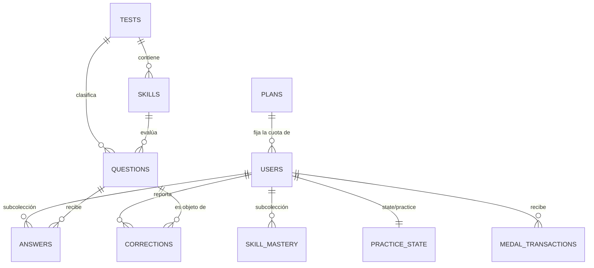

# Diccionario de datos del módulo de preguntas

**Proyecto:** Aprueba, producto de Alloxentric. Práctica para la PAES  
**Equipo:** Grupo 9, Duoc UC · Proyecto Capstone (PTY4614)  
**Entregable:** paquete de trabajo 1.3.2.1 de la EDT · Iteración 2 (semana 6). Modelo alineado con la administración el 2026-09-25 (ADR-57)  
**Responsable:** Jeremías Fernández  
**Base central:** Firestore en modo nativo, base `(default)` del proyecto `aprueba-app-modulo-preguntas`, en `southamerica-east1` (ADR-25)  
**Caché del dispositivo:** SQLite administrado con Drift  

---

La base es la misma que usa la consola de administración, así que los documentos que escribe el módulo tienen que poder leerse allá sin adaptaciones. La app nunca lee Firestore. Pasa por la API (ADR-03), y `firestore.rules` niega al cliente toda lectura y escritura (ADR-21). Este documento describe lo que guarda el backend.

El modelo sigue la regla de precedencia que decidió Max, de Alloxentric, el 23/09/2026 (ADR-57). Donde la especificación de la administración define una colección o un campo, se usa tal cual, con su nombre y su formato de ID. Donde no dice nada, manda el modelo de datos de junio (Modelo de Datos Firebase/Firestore v1.0) o su extensión para el generador de preguntas (v1.1). Lo que ninguno define es un supuesto o una propuesta, cada uno con su ADR.

Las secciones que se citan son de la especificación de la administración: 2.8 para las colecciones, 7 para usuarios, 7.2 para la cola de recorrecciones, 8 para planes y 9.3 para los procesos programados.

---

## 1. Origen de cada colección y campo

En la columna de origen, "administración" es la especificación de la consola, "junio" es el modelo de datos de junio y "generador" es su extensión v1.1. Los campos que dejaron de existir aparecen al final de su colección, sin origen.

| Colección | Campos | Origen | Qué cambió |
|---|---|---|---|
| `users` | ID `usr_<UID>` | Administración (2.8) | Antes era el UID solo (ADR-58). |
| `users` | `name`, `nameLower`, `email`, `emailLower`, `state`, `lastActivityAt`, `medalWallet`, `badgesTotal`, `createdAt`, `subscriptionId` | Administración (2.8) | Nuevos en el diccionario. `medalWallet` y `badgesTotal` reemplazan a `medals`, y `lastActivityAt` a `lastActiveDate`. |
| `users` | `plan`, `country` | Administración (2.8) | Ya estaban. `plan` acepta también los `pl_*` de la consola, y `country` va en mayúsculas. |
| `users` | `authProvider`, `age`, `streak` | Administración (7) y junio | Nuevos en el diccionario. |
| `users` | `school`, `region`, `locale` | Administración (7) y junio | Sin cambios. |
| `users` | `sessionsRevokedAt` | Administración (7) | Nuevo. Lo escribe la consola al suspender. |
| `users` | `quota`, `selectedTests`, `practiceFormat`, `difficulty` | Junio | Sin cambios de forma. `quota.max` sale ahora de `plans` (ADR-64). |
| `users` | `updatedAt`, `avatarColor`, `theme`, `planStatus`, `dailyReminder` | Junio | Nuevos en el diccionario. El módulo no los usa, pero el seed los escribe (ADR-69). |
| `users` | `gradeId` | Supuesto (ADR-28) | Sin cambios. |
| `users` | `medals`, `lastActiveDate` | | Salen, reemplazados por campos de la administración. |
| `users/{id}/answers` | `questionId`, `selected`, `correct`, `elapsedMs`, `cohortPercentile`, `answeredAt` | Junio | Pasan de la colección raíz `answers` a la subcolección (ADR-60). |
| `users/{id}/answers` | `testId`, `axis`, `skillId`, `sessionId`, `difficulty` | Junio | Nuevos. |
| `users/{id}/answers` | `userId` | | Sale: el alumno está en la ruta. |
| `users/{id}/skillMastery` | `testId`, `correct`, `total`, `percent`, `level`, `status`, `updatedAt` | Junio | Subcolección nueva en el diccionario. |
| `users/{id}/state/practice` | `answeredQuestionIds`, `lastQuestionId`, `lastAnsweredAt`, `activeSessionId` | Extensión del módulo (ADR-09 y ADR-65) | Cambia la ruta por el ID `usr_`. |
| `medalTransactions` | ID `mtx_`, `userId`, `tier`, `amount`, `reason`, `refId`, `at` | Administración (2.8) | Reemplaza a `users/{uid}/medalLedger` (ADR-59). `type` pasa a `reason`, `referenceId` a `refId` y `createdAt` a `at`. |
| `corrections` | ID `cor_`, `userId`, `userName`, `questionId`, `testId`, `reason`, `state`, `resolvedBy`, `resolvedAt`, `note`, `rewardGranted`, `createdAt` | Administración (2.8) | `status` pasa a `state`, `reviewedAt` a `resolvedAt` y `reviewedBy` a `resolvedBy`. `reason` pasa de código a texto. `rewardGranted` pasa a `{userId, tier, amount}` (ADR-61). |
| `corrections` | `axis`, `difficulty`, `statementPreview`, `proposedAnswer` | Administración (7.2) | Nuevos. |
| `corrections` | `comment` | Junio | Sin cambios. |
| `corrections` | `reasonCode` | Propuesta (ADR-67) | Nuevo. Guarda el código que antes iba en `reason`. |
| `corrections` | `potentialReward` | | Sale: la recompensa de la administración es fija (ADR-61). |
| `questions` | ID `qst_` | Administración (2.8) | Antes era `q_*` (ADR-62). |
| `questions` | `statement`, `options`, `correctAnswer`, `status` | Administración (2.8 y 7.2) y junio | `status` pasa de `active`, `draft` y `disabled` a los cuatro estados de la consola. |
| `questions` | `explanation` | Administración (7.2) | Sigue como texto. Junio la definía como mapa. |
| `questions` | `testId`, `axis`, `skillId`, `difficulty` | Junio | `axis` y `skillId` pasan a obligatorios. |
| `questions` | `requiredSkillText`, `flagCount`, `randomKey`, `stats`, `source`, `createdAt`, `updatedAt` | Junio | Nuevos. `source` reemplaza a `isDemo` (ADR-69). |
| `questions` | `countryId`, `examId`, `origin`, `reviewStatus`, `version` | Generador | Nuevos. |
| `questions` | `updatedBy`, `lastCorrectionId` | Administración (código de 7.2) | Nuevos. Solo los escribe la consola. |
| `questions` | `cohortSpeedThresholds`, `isDemo` | | Salen (ADR-63 y ADR-69). |
| `tests` | `label`, `color` | Junio | Sin cambios. |
| `tests` | `axes`, `order`, `active` | Junio | Nuevos. |
| `tests` | `countryId`, `examId`, `nameLower`, `approvedStock`, `targetStock` | Generador | Nuevos. |
| `tests` | `hasQuestions` | | Sale: la API lo deriva de `approvedStock` (ADR-69). |
| `skills` | `testId`, `name`, `level`, `maxLevel`, `resources` | Junio | Sin cambios. |
| `skills` | `axis`, `prerequisites` | Junio | Reemplazan a `domain` y `prerequisiteIds`. |
| `skills` | `createdAt`, `updatedAt` | Junio | Nuevos. |
| `skills` | `status`, `isDemo` | | Salen. `status` era el avance del alumno, que ahora está en `skillMastery`. |
| `plans` | `name`, `nameLower`, `price`, `currency`, `color`, `features`, `limits`, `badges`, `stripeProductId`, `stripePriceId`, `system`, `createdAt`, `updatedAt` | Administración (2.8 y 8) | Colección nueva en el diccionario (ADR-64). Junio definía otra forma, con `price {monthly, yearly}`, `popular`, `published`, `order` y `stripePriceIds`. |

---

## 2. Colecciones

### 2.1 `users`

Un documento por alumno, con ID `usr_` más el UID de Firebase Authentication (ADR-58). La consola cambia el plan y el estado. El módulo escribe la cuota y las preferencias, y suma medallas con cada movimiento de `medalTransactions`. Si el alumno no tiene documento, la propuesta de ADR-66 lo crea en su primera petición autenticada. `nameLower`, `lastActivityAt`, `badgesTotal` y `createdAt` tienen que existir en todos los documentos: la consola ordena por ellos, y Firestore deja fuera de una consulta ordenada a los documentos que no tienen el campo.

| Campo | Tipo | Req. | Origen | Descripción |
|---|---|:---:|---|---|
| `name` | string | Sí | Administración | Nombre completo. La consola lo lee sin valor por defecto. |
| `nameLower` | string | Sí | Administración | `name` en minúsculas, para buscar y ordenar. |
| `email` | string | Sí | Administración | Correo de Firebase Authentication. La consola lo lee sin valor por defecto. |
| `emailLower` | string | Sí | Administración | `email` en minúsculas. |
| `plan` | string | Sí | Administración | `free`, `uni`, `all` o un `pl_*` creado en la consola. Es el ID de un documento de `plans`. |
| `state` | string | Sí | Administración | `active`, `suspended` o `churned`. Con `suspended` el módulo responde 403 (sección 4). |
| `country` | string | No | Administración | ISO-3166 alfa-2 en mayúsculas, como `CL`. La consola filtra con `^[A-Z]{2}$`. |
| `lastActivityAt` | timestamp | Sí | Administración | Última actividad. Quién lo actualiza es propuesta (ADR-68). |
| `medalWallet` | map | Sí | Administración | `{bronze, silver, gold, diamond, platinum}`, enteros. Solo cambia en la transacción que crea el movimiento en `medalTransactions` (ADR-59). |
| `badgesTotal` | number | Sí | Administración | Suma de `medalWallet`. Sube junto con cada movimiento. |
| `createdAt` | timestamp | Sí | Administración | Alta. La consola lo lee sin valor por defecto. |
| `subscriptionId` | string | No | Administración | Suscripción vigente, `null` en el plan gratuito. |
| `authProvider` | string | Sí | Administración y junio | `password`, `google` o `apple`. |
| `school` | string | No | Administración y junio | Colegio declarado. Habilita el bono de colegio. |
| `region` | string | No | Administración y junio | Región declarada. Habilita el bono de región. |
| `age` | number | No | Administración y junio | Edad declarada. |
| `streak` | number | Sí | Administración y junio | Días seguidos con actividad. Quién la actualiza es propuesta (ADR-68). |
| `locale` | string | Sí | Administración y junio | `es` o `en`. En la API se llama `language`. |
| `sessionsRevokedAt` | timestamp | No | Administración | Lo escribe la consola al suspender. Ver sección 4. |
| `quota` | map | Sí | Junio | Cuota diaria. Ver 2.1.1. |
| `selectedTests` | `array<string>` | Sí | Junio | Pruebas elegidas. `GET /practice/next` solo sirve preguntas de estas pruebas. |
| `practiceFormat` | string | Sí | Junio | `random` o `facsim`. `facsim` requiere plan de pago. En la API se llama `format`. |
| `difficulty` | string | Sí | Junio | `d1`, `d2`, `d3` o `d4`. |
| `gradeId` | string | No | Supuesto (ADR-28) | Grado del estudiante, que guarda `PUT /me/preferences`. |
| `updatedAt` | timestamp | Sí | Junio | Última escritura. |
| `avatarColor` | string | Sí | Junio | Color de las iniciales. Lo usan otros módulos. |
| `theme` | string | Sí | Junio | `light` o `dark`. Lo usan otros módulos. |
| `planStatus` | string | Sí | Junio | `none`, `active`, `past_due` o `canceled`. Lo usan otros módulos. |
| `dailyReminder` | boolean | Sí | Junio | Recordatorio diario activo. Lo usan otros módulos. |

#### 2.1.1 Sub-esquema `quota`

`used` (number) cuenta las preguntas usadas en el día. `max` (number) es el límite del día: `min(qDay + bonos, QUOTA_CAP)`, con `qDay` de `plans/{plan}.limits`, o 0 cuando el plan es ilimitado (ADR-64). `date` (string) es el día de la cuota en formato `YYYY-MM-DD`, en el huso de reinicio de ADR-11; el formato es un supuesto (ADR-28). Si `date` no es el día de hoy, la cuota se reinicia: `used` vuelve a 0 y `date` pasa a hoy. `bonusSchool` y `bonusAddress` (boolean) marcan los bonos ya reclamados, que se reclaman una sola vez. `unlimited` (boolean) vale `true` cuando `qDay` es 0.

Los montos de los bonos no están en ningún documento y son constantes de `backend/app/core/config.py`: `SCHOOL_BONUS` 5, `ADDRESS_BONUS` 5, `QUOTA_CAP` 20 y `UNLOCK_MEDALS` 1, el bronce que da cada bono reclamado.

---

### 2.2 `users/{id}/answers`

Una respuesta por documento, en la subcolección del alumno (ADR-60). La API la crea en la transacción de responder, que también descuenta la cuota, otorga las medallas, suma la respuesta a `questions.stats` y actualiza `skillMastery` y `state/practice`. Nadie la modifica después (ADR-02). La API usa IDs automáticos; el seed usa `ans_` más los 10 hexadecimales de la pregunta, para que otra corrida reescriba los mismos documentos (ADR-69). Todos los campos son del modelo de junio.

| Campo | Tipo | Req. | Descripción |
|---|---|:---:|---|
| `questionId` | string | Sí | `qst_*` de la pregunta. |
| `testId` | string | Sí | Prueba, copiada de la pregunta. |
| `axis` | string | Sí | Eje, copiado de la pregunta. |
| `skillId` | string | Sí | Habilidad, copiada de la pregunta. |
| `selected` | string | Sí | Letra elegida, de `A` a `E`. |
| `correct` | boolean | Sí | Resultado que calcula el backend. |
| `elapsedMs` | number | Sí | Tiempo de respuesta en milisegundos, mayor que 0. |
| `cohortPercentile` | number | No | Percentil de rapidez al responder, de 0 a 100 (sección 5). |
| `sessionId` | string | No | Sesión o ensayo del formato facsímil. |
| `difficulty` | string | Sí | Dificultad, copiada de la pregunta. |
| `answeredAt` | timestamp | Sí | Hora del servidor al guardar. |

---

### 2.3 `users/{id}/skillMastery`

Dominio del alumno por habilidad, con el `skillId` como ID del documento. Se actualiza en la transacción de responder desde la iteración 4. Todos los campos son del modelo de junio: `testId` (string), `correct` (number, aciertos), `total` (number, intentos), `percent` (number, `correct` sobre `total` en porcentaje), `level` (number), `status` (`in_progress` o `mastered`) y `updatedAt` (timestamp). En el seed, `level` es el número de aciertos con tope en `maxLevel` y `status` pasa a `mastered` al llegar al tope (ADR-69).

---

### 2.4 `users/{id}/state/practice`

Extensión del módulo que ningún documento define (ADR-09 y ADR-65). Permite excluir las preguntas respondidas leyendo un solo documento, sin recorrer `answers`.

| Campo | Tipo | Req. | Descripción |
|---|---|:---:|---|
| `answeredQuestionIds` | `array<string>` | Sí | IDs `qst_*` ya respondidos. |
| `lastQuestionId` | string | No | Última pregunta entregada. |
| `lastAnsweredAt` | timestamp | No | Hora de la última respuesta. |
| `activeSessionId` | string | No | Sesión de estudio en curso. |

---

### 2.5 `medalTransactions`

Libro de movimientos de medallas, compartido con la consola (ADR-59). ID `mtx_` más 10 hexadecimales. Cada movimiento se escribe en la misma transacción que incrementa `users.medalWallet.<tier>` y `users.badgesTotal`.

| Campo | Tipo | Req. | Descripción |
|---|---|:---:|---|
| `userId` | string | Sí | `usr_*` del alumno. |
| `tier` | string | Sí | `bronze`, `silver`, `gold`, `diamond` o `platinum`. |
| `amount` | number | Sí | Cantidad, positiva al otorgar. |
| `reason` | string | Sí | Motivo, de la tabla siguiente. |
| `refId` | string | Sí | Documento o dato que originó el movimiento. |
| `at` | timestamp | Sí | Hora del servidor. |

| `reason` | Quién lo escribe | `amount` | `refId` |
|---|---|---|---|
| `answer_correct` | Módulo, al responder bien | `plans/{plan}.badges.correct`, en bronce | `qst_*` de la pregunta |
| `quota_bonus` | Módulo, al reclamar un bono | `UNLOCK_MEDALS`, 1 bronce | `bonusSchool` o `bonusAddress` |
| `daily_login` | Módulo, propuesta de ADR-68 | `plans/{plan}.badges.login`, en bronce | Fecha `YYYY-MM-DD` |
| `correction_confirmed` | Consola, al confirmar una recorrección | 250 bronces | `cor_*` de la solicitud |

La implementación de referencia de la consola crea `correction_confirmed` con un ID automático y le agrega el campo `by`, con el `adm_*` que confirmó. La sección 2.8 no lo nombra. Está por consultar con Max (ADR-59).

---

### 2.6 `corrections`

Solicitudes de recorrección (ADR-61). ID `cor_` más 10 hexadecimales. La API crea el documento con `state` `pending` y la consola lo resuelve. Al crearlo, la API suma 1 a `questions.flagCount` en la misma transacción. La consola no lo resta al resolver, y eso está por acordar con Max.

| Campo | Tipo | Req. | Origen | Descripción |
|---|---|:---:|---|---|
| `userId` | string | Sí | Administración | `usr_*` del alumno. La consola suma la recompensa en `users/{userId}`. |
| `userName` | string | Sí | Administración | Nombre del alumno al crear la solicitud. |
| `questionId` | string | Sí | Administración | `qst_*` de la pregunta. |
| `testId` | string | Sí | Administración | Prueba de la pregunta. La cola filtra por este campo. |
| `axis` | string | Sí | Administración (7.2) | Eje de la pregunta, copiado al crear. |
| `difficulty` | string | Sí | Administración (7.2) | Dificultad de la pregunta, copiada al crear. |
| `statementPreview` | string | Sí | Administración (7.2) | Enunciado en un renglón, de hasta 120 caracteres, con `…` si se corta. |
| `reason` | string | Sí | Administración | Texto que la cola muestra como motivo del alumno (ADR-67). |
| `proposedAnswer` | string | No | Administración (7.2) | Letra que el alumno cree correcta. `null` mientras la app no la pida. |
| `state` | string | Sí | Administración | `pending`, `confirmed` o `rejected`. |
| `createdAt` | timestamp | Sí | Administración | Hora del servidor al crear. La cola la lee sin valor por defecto y llama a `.isoformat()`. |
| `resolvedAt` | timestamp | No | Administración | Lo escribe la consola al resolver. |
| `resolvedBy` | string | No | Administración | `adm_*` de quien resolvió. |
| `note` | string | No | Administración | Nota de la consola, de hasta 1000 caracteres. |
| `rewardGranted` | map | No | Administración | `{userId, tier, amount}` al confirmar. `null` si se rechaza o si el alumno ya no existe. |
| `comment` | string | No | Junio | Comentario del alumno tal como llegó, de hasta 500 caracteres. |
| `reasonCode` | string | Sí | Propuesta (ADR-67) | `wrong_answer`, `ambiguous`, `typo`, `bad_explanation` u `other`. |

`CORRECTION_ALREADY_OPEN` se comprueba buscando una solicitud `pending` del mismo alumno sobre la misma pregunta. Esa consulta solo usa igualdades y no necesita índice compuesto.

---

### 2.7 `questions`

Banco de preguntas (ADR-62). ID `qst_` más 10 hexadecimales. El módulo solo sirve preguntas con `status` `published`, y el generador exige que `published` implique `reviewStatus` `approved`. `sanitize_question()`, en `backend/app/services/questions.py`, quita `correctAnswer` y `explanation` antes de responder `GET /practice/next` y `GET /questions/{id}` (ADR-12).

| Campo | Tipo | Req. | Origen | Descripción |
|---|---|:---:|---|---|
| `testId` | string | Sí | Junio | Prueba. |
| `axis` | string | Sí | Junio | Eje temático. |
| `skillId` | string | Sí | Junio | Habilidad que evalúa. |
| `difficulty` | string | Sí | Junio | `d1`, `d2`, `d3` o `d4`. |
| `statement` | string | Sí | Administración y junio | Enunciado en Markdown. La consola lo corrige con 10 a 4000 caracteres. |
| `options` | `array<string>` | Sí | Administración y junio | 4 o 5 alternativas distintas. |
| `correctAnswer` | string | Sí | Administración y junio | Letra de la alternativa correcta, de `A` a `E`. No sale hacia el cliente antes de responder. |
| `explanation` | string | Sí | Administración (7.2) | Texto de 10 a 4000 caracteres. Sale hacia el cliente solo después de responder. |
| `requiredSkillText` | string | Sí | Junio | Habilidad requerida, como texto. |
| `status` | string | Sí | Administración y junio | `draft`, `published`, `flagged` o `retired`. |
| `flagCount` | number | Sí | Junio | Solicitudes de recorrección abiertas. |
| `randomKey` | number | Sí | Junio | Número en [0, 1) para elegir la siguiente pregunta. |
| `stats` | map | Sí | Junio | Estadísticas de respuestas. Ver 2.7.1. |
| `source` | string | No | Junio | Lote de origen. `seed_demo` en el banco de demostración (ADR-69). |
| `countryId` | string | Sí | Generador | País, `cl`. |
| `examId` | string | Sí | Generador | Prueba nacional, `cl_paes`. |
| `origin` | string | Sí | Generador | `manual` o `ai`. |
| `reviewStatus` | string | Sí | Generador | `draft`, `pending_review`, `observed`, `rejected` o `approved`. |
| `version` | number | Sí | Generador | Sube con cada edición de fondo. |
| `createdAt` | timestamp | Sí | Junio | Alta. |
| `updatedAt` | timestamp | Sí | Junio | Última actualización. |
| `updatedBy` | string | No | Administración (código de 7.2) | `adm_*` de quien corrigió la pregunta. |
| `lastCorrectionId` | string | No | Administración (código de 7.2) | `cor_*` que originó la última corrección. |

El generador define además `contentId`, `batchId`, `materialIds`, `assignedReviewerUid` y `reviewSummary`, y el modelo de junio `createdBy`. Son opcionales, el módulo no los lee y el seed no los escribe.

#### 2.7.1 Sub-esquema `stats`

`timesAnswered` y `timesCorrect` (number) cuentan las respuestas y los aciertos. `sumElapsedMs` (number) suma los tiempos, para sacar el promedio. `elapsedBuckets` (map) cuenta las respuestas por tramo de tiempo, con los diez tramos de la sección 5. La transacción de responder actualiza los cuatro campos.

---

### 2.8 `tests`

Catálogo de pruebas PAES, con IDs naturales: `lectora`, `m1`, `m2`, `cien` y `hist`.

| Campo | Tipo | Req. | Origen | Descripción |
|---|---|:---:|---|---|
| `label` | string | Sí | Junio | Nombre visible. |
| `color` | string | Sí | Junio | Color `#RRGGBB`. |
| `axes` | `array<string>` | Sí | Junio | Ejes temáticos de la prueba. |
| `order` | number | Sí | Junio | Orden de despliegue. |
| `active` | boolean | Sí | Junio | Prueba disponible. |
| `countryId` | string | Sí | Generador | `cl`. |
| `examId` | string | Sí | Generador | `cl_paes`. |
| `nameLower` | string | Sí | Generador | `label` en minúsculas. |
| `approvedStock` | number | Sí | Generador | Preguntas con `reviewStatus` `approved`. La API entrega `hasQuestions` como `approvedStock > 0` (ADR-69). |
| `targetStock` | number | No | Generador | Meta de preguntas aprobadas. El seed no la escribe. |

---

### 2.9 `skills`

Habilidades por prueba, con ID `sk_` más un nombre corto. Todos los campos son del modelo de junio.

| Campo | Tipo | Req. | Descripción |
|---|---|:---:|---|
| `testId` | string | Sí | Prueba. |
| `name` | string | Sí | Nombre de la habilidad. |
| `axis` | string | Sí | Eje. |
| `level` | number | Sí | Nivel de la habilidad, de 1 a `maxLevel`. |
| `maxLevel` | number | Sí | Niveles totales. |
| `prerequisites` | `array<string>` | No | IDs de las habilidades previas. |
| `resources` | `array<map>` | No | Material de estudio: `{type, title, duration, source, url}`. `type` es `video`, `pdf` o `exercise`. |
| `createdAt` | timestamp | Sí | Alta. |
| `updatedAt` | timestamp | Sí | Última actualización. |

---

### 2.10 `plans`

Planes de la consola (ADR-64). Los de sistema tienen ID `free`, `uni` y `all`, y los que crea la consola `pl_*`. El módulo solo los lee: de aquí salen la base de la cuota y las medallas por acierto. El seed crea los tres de sistema.

| Campo | Tipo | Req. | Descripción |
|---|---|:---:|---|
| `name` | map | Sí | `{es, en}`. |
| `nameLower` | string | Sí | Nombre en español, en minúsculas. La consola rechaza dos planes con el mismo. |
| `price` | number | Sí | Precio mensual. `free` siempre vale 0. |
| `currency` | string | Sí | `USD` o `CLP`. |
| `color` | string | Sí | Color del plan. |
| `features` | `array<string>` | Sí | IDs del catálogo `features` de la consola, de `f1` a `f10`. |
| `limits` | map | Sí | `{qDay, groups, tests}`. `qDay` es la base diaria de preguntas, y 0 es ilimitado. |
| `badges` | map | Sí | `{login, purchase, correct}`. `correct` son los bronces por respuesta correcta y `login` los del primer ingreso del día. |
| `stripeProductId` | string | No | Producto en Stripe. |
| `stripePriceId` | string | No | Precio en Stripe. |
| `system` | boolean | Sí | `true` en los planes de sistema, que no se pueden borrar. |
| `createdAt` | timestamp | Sí | Alta. |
| `updatedAt` | timestamp | Sí | Última edición. La consola lo compara con `If-Unmodified-Since` al editar. |

Valores que carga el seed, tomados de los ejemplos de la sección 8:

| Plan | `limits.qDay` | `badges.login` | `badges.purchase` | `badges.correct` |
|---|---:|---:|---:|---:|
| `free` | 20 | 1 | 0 | 1 |
| `uni` | 0 | 1 | 5 | 1 |
| `all` | 0 | 2 | 10 | 2 |

`qDay` 20 en `free` choca con la regla de negocio 1, que da una base de 10 y un tope de 20. Está por confirmar con Max (ADR-64).

---

## 3. Contrato de la API a partir de Firestore

Los nombres de la API son los del contrato que usa la app, en `lib/data/models/models.dart`. Ninguna de estas rutas existe todavía. `GET /me` se implementa en la iteración 3, junto con el alta de ADR-66.

### 3.1 `GET /me`

Responde el modelo `User` a partir de `users/usr_<UID>` (ADR-66).

| Campo de la API | Sale de | Nota |
|---|---|---|
| `id` | ID del documento | `usr_<UID>`, el mismo que usan `corrections` y `medalTransactions`. La app no lo compara con nada. |
| `name`, `email`, `plan`, `streak` | Campos del mismo nombre | |
| `quota.used` | `quota.used` | Después de reiniciar la cuota si `quota.date` no es hoy. |
| `quota.max` | `quota.max` | 0 en un plan ilimitado. `User` no trae `unlimited`, y la app reconoce los planes de pago por `plan` distinto de `free`. |
| `medals` | `medalWallet` | Mismo mapa de cinco niveles. |
| `school`, `region`, `age`, `authProvider` | Campos del mismo nombre | |
| `phone` | No se guarda | `null`. La verificación por SMS está apagada (ADR-40). |
| `phoneVerified` | No se guarda | `false`. |
| `country` | `country` | |
| `language` | `locale` | |
| `gradeId` | `gradeId` | Supuesto de ADR-28. |
| `onboarded` | Se deriva | `true` si `selectedTests` tiene al menos una prueba (ADR-28). |

### 3.2 `GET /me/quota`

Responde `QuotaState`. `used` y `max` salen de `quota`. `base` es `plans/{plan}.limits.qDay`. `bonuses.school` y `bonuses.address` salen de `quota.bonusSchool` y `quota.bonusAddress`. `unlimited` sale de `quota.unlimited`, y `resetsAt` es la medianoche siguiente en el huso de ADR-11.

### 3.3 `GET` y `POST /corrections`

Responden `Correction`. `status` sale de `state`, `reviewedAt` de `resolvedAt` y `reviewedBy` de `resolvedBy`. `reason` sale de `reasonCode` y `comment` de `comment` (ADR-67). `rewardGranted` se entrega como `{amount}` con el `amount` guardado. `potentialReward` no se guarda: mientras `state` es `pending`, la API entrega `{amount: 250}`, la recompensa fija de la administración (ADR-05).

---

## 4. Alumno suspendido

Con `state` `suspended`, los endpoints del módulo responden `AUTH_FORBIDDEN` 403 aunque el token de Firebase siga vigente (ADR-65). Se implementa con los endpoints.

La consola escribe además `sessionsRevokedAt` al suspender, y su especificación dice que la API del alumno lo comprueba. La propuesta de ADR-65 es responder 401 `AUTH_REQUIRED` cuando el `auth_time` del token, la hora en que el alumno inició sesión, es anterior a ese campo. Un token renovado conserva su `auth_time`, así que el reintento de la app recibe otro 401 y la app cierra la sesión (ADR-40).

---

## 5. Tramos del histograma y percentil de cohorte

`questions.stats.elapsedBuckets` tiene diez tramos (ADR-63), definidos en `ELAPSED_BUCKETS`, en `backend/app/services/questions.py`. Cada tramo cuenta las respuestas con tiempo menor que su límite y mayor o igual que el límite del tramo anterior.

| Tramo | Tiempo de respuesta |
|---|---|
| `lt10` | Menos de 10 s |
| `lt20` | De 10 s a menos de 20 s |
| `lt30` | De 20 s a menos de 30 s |
| `lt45` | De 30 s a menos de 45 s |
| `lt60` | De 45 s a menos de 1 min |
| `lt90` | De 1 min a menos de 1 min 30 s |
| `lt120` | De 1 min 30 s a menos de 2 min |
| `lt180` | De 2 min a menos de 3 min |
| `lt300` | De 3 min a menos de 5 min |
| `gte300` | 5 min o más |

El percentil de una respuesta nueva se calcula con el histograma de antes de sumarla: 100 × (respuestas en tramos más lentos + la mitad de las del mismo tramo) / total, redondeado. Sin respuestas previas vale 50. Por ejemplo, si una pregunta tiene 2 respuestas en `lt20`, 3 en `lt30` y 1 en `lt60`, una respuesta nueva de 25 s cae en `lt30`. Hay 1 más lenta y 3 en su tramo, así que su percentil es 100 × (1 + 1,5) / 6, que da 42.

---

## 6. Índices compuestos

Están en [`firestore.indexes.json`](../firestore.indexes.json). Los índices de campo simple los crea Firestore solo. Con ellos alcanza para el historial del alumno, que ordena por `answeredAt DESC` dentro de su subcolección, y para el conteo de solicitudes pendientes de la consola. Las consultas que solo usan igualdades tampoco necesitan índice compuesto.

| Colección | Alcance | Campos | Consulta |
|---|---|---|---|
| `questions` | Colección | `testId ASC`, `status ASC`, `difficulty ASC`, `randomKey ASC` | `GET /practice/next`: prueba, `published`, dificultad y `randomKey` desde un número al azar, con límite 1 (ADR-62). |
| `answers` | Grupo de colecciones | `questionId ASC`, `answeredAt DESC` | Respuestas de una pregunta entre todos los alumnos (modelo de junio). Ninguna ruta del módulo la usa todavía: el percentil sale del histograma. |
| `answers` | Grupo de colecciones | `skillId ASC`, `correct ASC` | Dominio por habilidad entre todos los alumnos (modelo de junio). Ninguna ruta del módulo la usa todavía. |
| `corrections` | Colección | `userId ASC`, `createdAt DESC` | Historial de solicitudes del alumno. |
| `corrections` | Colección | `state ASC`, `createdAt` ASC y DESC | Cola de la consola filtrada por estado (ADR-61). |
| `corrections` | Colección | `testId ASC`, `createdAt` ASC y DESC | Cola filtrada por prueba. |
| `corrections` | Colección | `questionId ASC`, `createdAt` ASC y DESC | Solicitudes sobre una pregunta. |

Cuando la consola combina filtros, Firestore une los índices de `corrections` porque terminan en el mismo campo de orden. El listado de usuarios de la consola necesita otros índices, que su especificación declara en su propio `firestore.indexes.json` y que este archivo no incluye (ADR-57).

---

## 7. Esquema local de caché offline (Drift / SQLite)

Ubicación: [`lib/data/local/database.dart`](../lib/data/local/database.dart)

### 7.1 Tabla `CachedQuestions`
* **Propósito:** Almacenar preguntas descargadas para permitir resolución y repaso offline.

| Columna | Tipo SQLite | Nulo | Descripción |
|---|---|:---:|---|
| `id` | TEXT PRIMARY KEY | No | Identificador idéntico a Firestore `questions.id`. |
| `testId` | TEXT | No | Código de la prueba PAES. |
| `axis` | TEXT | Sí | Eje temático. |
| `difficulty` | TEXT | Sí | Nivel `d1..d4`. |
| `statement` | TEXT | No | Enunciado en Markdown. |
| `optionsJson` | TEXT | No | Serialización JSON del arreglo de opciones. |
| `correctAnswer` | TEXT | Sí | **Debe ser NULL al descargar de `/practice/next`**. Solo se actualiza tras respuesta. |
| `shortExplanation` | TEXT | Sí | Explicación breve posterior a respuesta. |
| `explanationJson` | TEXT | Sí | Estructura detallada de resolución. |
| `skillJson` | TEXT | Sí | Metadatos de la habilidad asociada. |

### 7.2 Tabla `AnswerLogs`
* **Propósito:** Bitácora local de respuestas emitidas para sincronización en contingencia.

| Columna | Tipo SQLite | Nulo | Descripción |
|---|---|:---:|---|
| `id` | INTEGER PRIMARY KEY AUTOINCREMENT | No | Identificador secuencial local. |
| `questionId` | TEXT | No | ID de la pregunta respondida. |
| `selected` | TEXT | No | Alternativa elegida (`A..E`). |
| `correct` | BOOLEAN | No | Resultado de la evaluación. |
| `elapsedMs` | INTEGER | No | Tiempo cronometrado en milisegundos. |
| `answeredAt` | DATETIME | No | Marca temporal de la respuesta. |
